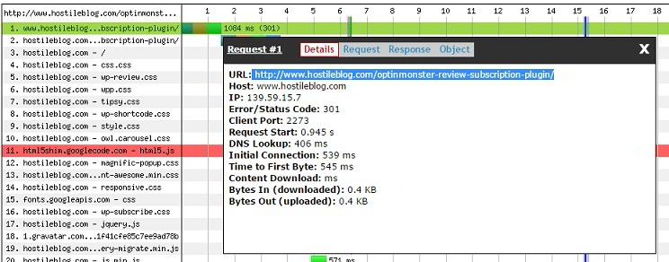

TTFB aka first-byte time is nothing but the time taken by the first byte to reach the client machine when the client seeks a response from the server after the browser running on it makes an HTTP GET request. A small TTFB value indicates that your web server is fast. A high TTFB value denotes that your site is slow in responding to the browser's HTTP GET request. To fix the problem, you'll have to work on the code or check web server and DB configuration.

Before you begin optimizing your website, test its ping time and TTFB with the web page analysis tool. WPT is the best website performance testing tool. It allows you to choose a location from which you want your site to be tested. Along with generating various test results, this tool suggests tips on improving your website's page speed.

If you're using Chrome, open any web page of your site, open the developer tools module of Chrome and navigate to network section to check your website's TTFB from your current location.

Once the browser or WPT tool makes you aware of your websites TTFB, check if the value is above 1 second or not. It the value is above 1 second, fix the below issues to reduce it:

### Slow MySQL Queries:

If the database server is responding slowly, the frontend's performance will be impacted, and this will result in high TTFB. Popular DB servers are well designed. Their code shouldn't be blamed for the poor performance of your website. The DB is taking a time to generate a result set because of a bad DB design or slow SQL queries. To identify the unoptimized SQL queries, enable the MySQL slow query log.

Once you find the culprit query, optimize it. If a WordPress plugin is firing the query, make sure that you remove the plugin or ask the developer to improve it. To fix the problem on a site which fires select queries most of the time, enable MySQL query cache if your DB tables are powered by the MyISAM engine.

Install PHP caching extensions such as OpCache and APCU and enable them. If you're using WordPress, install wp super cache or WordPress total cache plugin and enable it.

### Server configuration

If your high traffic website is deployed on a low-end server, then don't expect your site to have a great TTFB value. The server may have a slow CPU and RAM with low clock speed. If your website is dynamic, then the code should be executed faster else the server's response time will be high.

### Change server location

The physical location of a server can impact the ping time, server response time and the DNS lookup time. If you want to reduce TTFB, you'll have to reduce the ping time of the server. To do so, check Google Analytics location report for identifying the country from which your website gets the maximum traffic. Once you've identified the country, find the best hosting provider in the country and deploy your site on their server.

### Identify Network connectivity issues

Run traceroute test to check if there's loss of data packets when the server response data is on the way to the client computer. If there's data loss, contact the hosting provider and ask them to fix the issue.

**Conclusion**: A website's TTFB value should be below 1 second for the best experience of the visitor. If your site's first-byte time is more than 1 sec, follow the tips we've shared in this article to reduce it.
