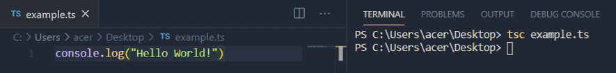
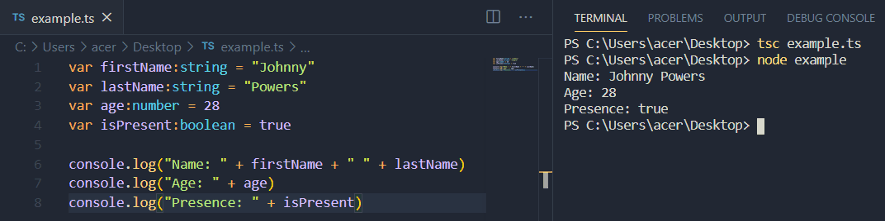
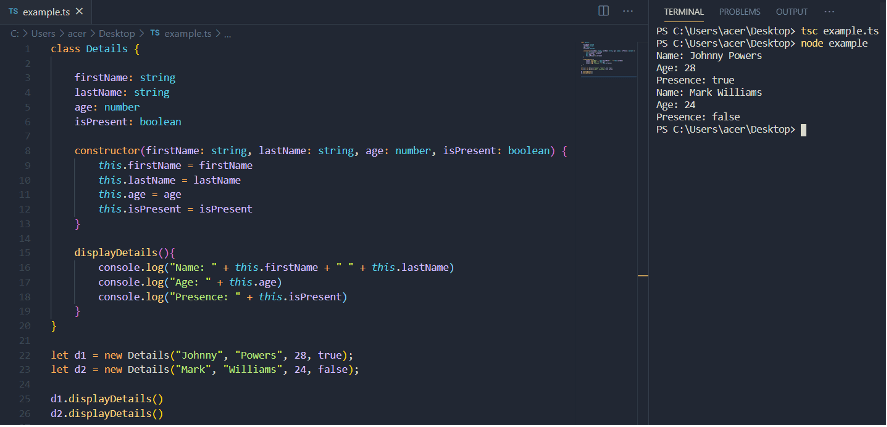

TypeScript can be a confusing term for anyone new to JavaScript development. The first impression of TypeScript for beginners is that it is a programming language, more or less, similar to JavaScript. Even professionals with enough coding experience often fail to define TypeScript. So how can we put the answer to this question - What is TypeScript?

TypeScript is a superset of JavaScript. It has optional static typing, classes, and interfaces. TypeScript is not a separate programming language, what makes it different from JavaScript lies in part of its name - _Type_. Every programming language has data types, In JavaScript these include the commonly used number, string, boolean, etc. To understand TypeScript, we first need to understand how JavaScript behaves with its data types.

## Weak and Strongly typed Languages

JavaScript is a dynamically typed language, which means the type of variables defined is checked at runtime. When we write a JavaScript code and declare variables, we don't define any data type, we simply declare a variable.

```javascript
a = 1234
b = "Hello"
c = true
```

In JavaScript, we can declare a variable and assign a value to it, and then later we can assign another value to different data types. We can keep on doing this and it is possible because JavaScript is a dynamically-typed language.

```javascript
let a = 100
a = "Hello"
a = 1234
```

The above code will work fine. The first value assigned to the variable "a" is a number and then a string is assigned to it. After that, again a Number is assigned to it. This may be not possible in other languages that are statically (or strongly) typed.

Due to the nature of being dynamically-typed, JavaScript is also a weak-typed language. By weak-typed, it means we can do anything in the expression.

```javascript
 let a = "100"
 let b = 200
 let c = a + b 
```

"a" holds a string while b holds a Number. Yet, when both of these are added and assigned to "c", it works fine. Something like this may not be possible in other programming languages. A weak-typed language has relaxed and lenient rules while it's opposite, a strong-typed language has more strict rules.

## Features of TypeScript

### 1\. Object-oriented

JavaScript has traditionally not supported object-oriented programming features, however in later versions it has improved. TypeScript supports object-oriented programming out of the box. It comes with features such as classes, interfaces, modules, and more.

### 2\. JavaScript is TypeScript

Apart from differences, both JavaScript and TypeScript have many similarities. Actually, JavaScript is TypeScript. Any file with .js extension (JavaScript file) can be converted into a TypeScript .ts file. 

### 3\. Support for JavaScript libraries

As mentioned above, JavaScript is TypeScript. So each element of JavaScript is supported in TypeScript. All JavaScript libraries, frameworks, modules, and existing code work with TypeScript.

### 4\. DOM manipulation

Like JavaScript, DOM manipulation is also possible with TypeScript.

### 5\. Portable

TypeScript is extremely portable. It can run on any browser, operating system, or device. TypeScript can run in any environment where JavaScript can.

## Working with TypeScript

To work with TypeScript, we first have to install it. 

TypeScript can be installed using the Node Package Manager. Make sure Node.js and NPM installed. Open a terminal and run the following command.

```javascript
npm install -g typescript
```

The command will install TypeScript globally. Now we can create our first TypeScript program.

Create a new file and name it example.ts. While creating a JavaScript file, we use .js extension. In the case of the TypeScript file, we use .ts. Next, paste the following line of code into the newly created .ts file.

```bash
console.log("Hello World!")
```

To run the TypeScript file, run the following command.

```bash
tsc example.ts
```

This command will not actually run the file, but convert it into a JavaScript file. You will find a JavaScript file of the same name in the same directory. Now use the basic node command to run the JavaScript file.

```bash
node example.ts
```



Next, create variables with different data types in TypeScript.

```javascript
 var firstName:string = "Johnny"
 var lastName:string = "Powers"
 var age:number = 28
 var isPresent:boolean = true
 console.log("Name: " + firstName + " " + lastName)
 console.log("Age: " + age)
 console.log("Presence: " + isPresent) 
```

You should notice the first major difference and benefit of TypeScript over JavaScript. TypeScript is a strongly typed language and therefore we declare variables using data types as shown in the example below.



Another major feature of TypeScript is its support for object-oriented programming. Let's walk through an example:

```javascript
class Details {
​  firstName: string
​  lastName: string
​  age: number
  ​isPresent: boolean
  constructor(firstName: string, lastName: string, age: number, isPresent: boolean) {
     ​​this.firstName = firstName
     ​​this.lastName = lastName
     ​​this.age = age
​​     this.isPresent = isPresent
  }
 ​
  ​displayDetails(){
    ​​console.log("Name: " + this.firstName + " " + this.lastName)
​​    console.log("Age: " + this.age)
    ​​console.log("Presence: " + this.isPresent)
​  }
}

let d1 = new Details("Johnny", "Powers", 28, true);
let d2 = new Details("Mark", "Williams", 24, false);

d1.displayDetails()
d2.displayDetails() 
```

In the above TypeScript code, we declared a class named "Details". This class has four variables with data types, a constructor, and a method named "displayDetails". It has two different objects (d1 and d2) and these objects are used to initialize. In the end, the method "displayDetails" is called using the two objects.



## Advantages and disadvantages of TypeScript

Hopefully by now you will have an understanding of the advantages of using TypeScript. It checks error during compile time while JavaScript checks during runtime. Because of this, solving errors becomes easy in TypeScript. As we discussed earlier, TypeScript is strong-typed whereas JavaScript is not. TypeScript supports class and modules and has great tooling support. Some of the disadvantages or drawbacks of TypeScript include the compilation time, which can be high. In addition to this, while running TypeScript in a browser, it is required to compile TypeScript into JavaScript first.

## Conclusion

TypeScript is not that complicated as it may seem. It is nothing more than a super-set of JavaScript with several new features such as types and classes. In this article, we discussed what is TypeScript and how it is different from JavaScript. The main point is that JavaScript is a weak-typed language while TypeScript has strict rules. I feel it is definitely work learning and exploring in your own projects to determine the real value it can bring. TypeScript is popular and commonly used in the development community. Finally, JavaScript has flaws thatTypeScript can help to avoid. Professionals who work with TypeScript tend to highly advocate for using it in any work that involves JavaScript development. To learn more about TypeScript, be sure to visit the official site at typescriptlang.org, where you will find plenty of resources for documentation, help, and a sandbox for trying it out.
