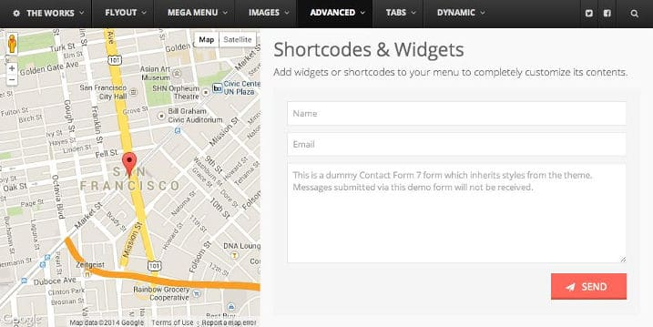
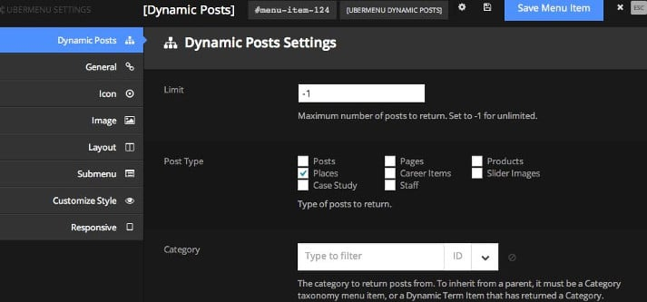

Mega menus have become a new trend in the world of internet. They make navigation much easier for the user as well makes your website more beautiful.

Mega Menus are created with the help of CSS, JS/Jquery, and HTML. Creating them is not an easy task. Only a seasoned developer with good knowledge of the above-mentioned technologies will be able to design and code a perfect mega menu.

WordPress users are fortunate because they don't have to write code for implementing new features in their websites. They'll find all types of plugins on the WordPress.org repo and CodeCanyon.

Adding stylish mega menu to a blog is possible without writing a single line of code. One of the best plugin to do this job is UberMenu, a top rated and widely mega menu plugin for WordPress. It is a premium plugin which costs $19.

Available for **download on CodeCanyon**, the Uber menu is one of the most downloaded premium WordPress plugin. UberMenu has around 60000 users and an excellent rating of 4.6.

The plugin adds a fully responsive navigation system to your WP site. When a website powered by it is opened on a mobile phone, the user will be able to interact with the mega menu as it comes with touch support.

Users can easily assign images to individual menu items through the plugin's setting panel. Users can change the picture size and change its default position in the menu bar.

The plugin has an option of loading the image dynamically from the blog post. This feature will save your time in situations where you have added a lot of options to your mega menu.

UberMenu plugin has an option of adding any WordPress widget to the menubar. For example, you can make the menubar more attractive by adding a contact form, WordPress search box, Google Map or any other widget of your choice.

UberMenu supports customization with the WordPress customizer tool. Thus, you can live preview the changes you made to your mega menu. In the customizer, the user will find more than 50 options to configure. The plugin supports custom CSS codes as well.

UberMenu's most important feature is its ability to generate dynamic content on the fly. You can specify how many posts the plugin should load when the user hovers his mouse cursor on the menu. You can set the post type from which the menubar should load posts. The plugin has a category filter tool to shortlist posts.

A big blog may have many categories and tags. On such blogs, it will not be surprising to see the webmaster adding a lot of menu items to the mega menu. As the UberMenu plugin has been designed and developed for all types of blogs, it is possible to create complex menu-bars with this plugin.

UberMenu has a feature to create tabbed menu items which be configured to open when the user clicks or hovers his/her mouse over it. It supports nested aka Hierarchical tabs.

FontAwesome powers the plugin. You have an option of choosing 50 stylish and high-quality icons in your mega menu. If you need more icons, then you should consider downloading the special icon packs for UberMenu. Users of this plugin are allowed to change the icon color, font size, and position. UM supports Google Fonts.

**See the demo here.**

The plugin has a powerful settings panel which saves your options on the fly with the Ajax technology. UberMenu is easy to use extension, and you can configure it in one or two minutes. If you want to understand its features in details, go through the documentation of this plugin.

UberMenu will automatically integrate itself with themes which implements wp\_nav\_menu WordPress function and makes use of theme\_location setting (i.e., WordPress 3+ menu system). If your theme doesn't meet these requirements, you must manually insert the mega menu code in the theme

UberMenu developers have been labeled as elite authors by CodeCanyon because WordPresss users blindly accept their products and they offer excellent support to the customers. The developer has released several updates for this plugin. The last update was rolled out in March 2016.

Cons:

- Not compatible with IE7, IE6, i.e., older browsers.
- Not all themes support automatic integration.

Pros:

- Jquery effects.
- Settings panel to configure options.
- Well documented plugin.
- Support for a complex hierarchical navigation system.
- Responsive.

**Conclusion**: If you own a big blog or if you want to upgrade the dated menu bar of your site with a mega menu, you might find the UberMenu plugin useful (**download link**). Configuring and implementing UberMenu is easy. If users find this confusing, they should go through the documentation or contact the developers.
