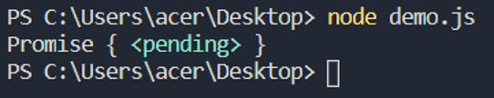
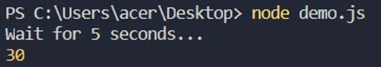
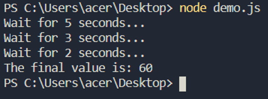
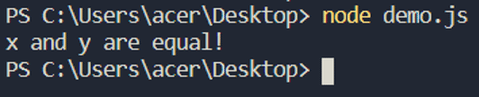
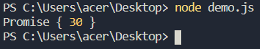
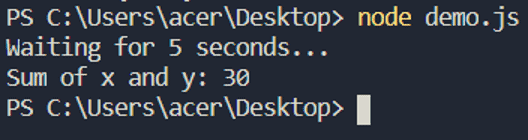

The term "asynchronous" is often associated with JavaScript, which can be a confusing concept, especially for beginners. This can become even more confusing because JavaScript is a synchronous language with asynchronous capabilities. In order to understand asynchronous development in general, we need to start with the difference between synchronous and asynchronous programming. In simple terms, executing one task or item at a time is often referred to as synchronous, while executing multiple tasks (or threads) at a time is referred to as asynchronous.

JavaScript is synchronous, single-threaded, and blocking language. It is synchronous, meaning it can execute one statement at a time. It is single-threaded, meaning, it has a single "call stack". We will discuss blocking later, but for now let's take a look at how JavaScript executes code:

```javascript
function fun(){
    console.log("Executed in the function");
}

console.log("Executed first...");

fun();

console.log("Executed last...");
```

It is a very simple code, but we need to dig a little bit deeper and look at execution context and the call stack. An environment where the JavaScript code is evaluated and executed is called the Execution context. There are two types of execution context in JavaScript, Global Execution Context (GEC), and Functional Execution Context (FEC). The execution contexts are stored in a stack called the call stack. There is only one call stack in JavaScript because it is a single-threaded programming language. The call stack is based on LIFO, meaning, Last In First Out. Let's break down the above code to better understand the call stack.

1\. When the code is executed, a global execution context is created which is the first entry in the call stack.

```javascript
main() ->
```

2\. Next, console.log("Executed first...") is pushed into the stack.

```javascript
main() -> console.log("Executed first...")
```

3\. After its execution is completed, it is popped out of the stack.

```javascript
main() ->
```

4\. After that, fun() is pushed into the stack.

```javascript
main() -> fun() ->
```

5\. Now, fun() is executed. console.log("Executed in the function") is pushed in the stack.

```javascript
main() -> fun() -> console.log("Executed in the function") ->
```

6\. After the console statement is executed, it is popped out.

```javascript
main() -> fun() ->
```

7\. Function execution ends and fun() is popped out.

```javascript
main() ->
```

8\. Next, console.log("Executed last...") is pushed into the stack.

```javascript
main() -> console.log("Executed last...") ->
```

9\. console.log("Executed last...") executes and is popped out.

```javascript
main() 
```

10\. Program execution is completed, so the main() is also removed from the stack.

The purpose of the above demonstration was to illustrate how JavaScript executes code line by line and only moves to the next line when the previous command has completed its execution. This is synchronous JavaScript. I also wrote an earlier article which explains the call stack in context of synchronous execution in more detail see: JavaScript Call Stack - Ian Carnaghan.

In the example, nothing was blocked, but there can be scenarios when the call stack is blocked due to reasons such as calling APIs, which can block the call stack. Network requests generally take time, therefore blocking the call stack:

```javascript
function APICall(url){
    // some operation
}

APICall(url)

console.log("Execution ends here...");
```

In the above code, the "APIcall" function is calling an API. First, the APICall function completes execution followed by, console.log("Execution ends here..."). Since the APICall function is making an API call, it can take some time to complete. Therefore, the execution is blocked at this point and the console statement will not run until APICall is completed. This illustrates the downside of synchronous programming. In asynchronous programming, execution would not stop. It would not wait for the APICall function to complete the execution, instead it would move further, executing the console statement. One way to achieve this is through the use of callback functions.

## Callback functions

JavaScript functions are considered first-class functions. A JavaScript function can be assigned to a variable, passed to another function as a parameter, and also it can be returned from another function. You can learn more about this here.

A function passed to another function as an argument is known as a callback function. Here's a simple example:

```javascript
console.log("Executed first...");

setTimeout(() => {
    console.log("Executed after 5 seconds...");
  }, 5000);

console.log("Executed last...");
```

Normally, console.log("Executed first...") should be executed first, followed by the setTimeout function, and finally console.log("Executed last..."). But the above code is not synchronous, it is asynchronous. To understand this better, take a closer look at the setTimeout function.

```javascript
setTimeout(() => {
    console.log("Executed after 5 seconds...");
}, 5000);
```

The first parameter of the setTimeout function is a callback function and the second parameter is 5000, meaning 5 seconds. This means, the callback function will be executed after 5 seconds. The output of the code should look like this:

- Executed first...

- Executed last...

- Executed after 5 seconds...

Notice the execution will not wait for 5 seconds, instead it will move to the next statement and execute the console command - console.log("Executed last..."). After 5 seconds, console.log("Executed after 5 seconds...") will be executed. This is not synchronous nor blocking, instead it is asynchronous and non-blocking.

The setTimeout function waits for 5 seconds while the execution moves to the next line. After 5 seconds, the callback function of the setTimeout function is executed. This is how the callback function prevents blocking and helps in asynchronous programming.

Going back to the call stack again, here's what is happening:

1\. **console.log("Executed first...")** is pushed into the stack.

```javascript
main() ->; console.log("Executed first...")
```

2\. After its execution, the console statement is popped out and the setTimeout function is pushed into the stack.

```javascript
main() -> setTimeout()
```

The setTimeout function executes. It will wait for 5 seconds and then execute the callback function. This function is a part of the browser's web APIs. The timer is pushed in the web API environment.

3\. In parallel, the execution of setTimeout has ended and it is popped out of the stack while the next statement - console.log("Executed last...") is pushed into the stack.

```javascript
main() -> console.log("Executed last...")
```

4\. After the console statement has executed, it is popped out of the stack.

At this point, the output is:

- Executed first...

- Executed last...

Meanwhile, the timer is still going on in the web API environment and when it ends, the callback function is pushed into the "message queue".

5\. At the point when the timer expires, the "event loop" checks the message queue if any callback exists. In our case, one callback is present in the message queue, and is pushed into the call stack.

```javascript
main() -> callback()
```

6\. The callback executes.

```javascript
main() -> callback() -> console.log("Executed after 5 seconds...")
```

7\. After the console statement is executed, it is popped out along with the callback function.

```javascript
main()
```

8\. In the end, the execution is completed and we have the following output.

- Executed first...

- Executed last...

- Executed after 5 seconds...

Note two important terms here - message queue and event loop.

- Message queue: Where the callbacks are held.

- Event loop: Checks if any callback is present in the message queue.

Next, let's take a look at creating our own callback function:

```javascript
function add(x, y, callback){
    var z = x + y;
    callback(z);
}

add(10, 20, function(z){
    console.log("Double of z:", z * 2)
})
```

The "add" function has three arguments - x, y, and a callback function. The sum of x and y is calculated in the add function and then, it is passed to the callback function. We can also break out the above code this way:

```javascript
function double(z){
    console.log("Double of z:", z * 2)
}

function add(x, y, callback){
	var z = x + y;
	callback(z);

}

add(10, 20, double);
```

Instead of passing an anonymous function, here we just create a separate function.

## Callback hell

Using callback functions is a way to develop synchronously, but overuse can result in what has commonly been coined as callback hell. This is a situation when too many nested callbacks are used.

```javascript
const userVerification = function(uname, pword, callback){
    db.userVerification(uname, pword, (err, info) =>{
        if(err){
            callback(err)
        }
	else{	
	    db.fetchRoles(uname, (err, roles) =>{	
	        if(err) {
		    callback(err)
		}
		else{
		    callback(null, info, roles)
		}
            }
	}
   
    }
}
```

As you can probably tell, the code above is complicated. First, the "userVerification" method is called for "info, next the "fetchRoles" method is called for "roles". As these are database operations, they can take some time to complete, therefore we are leveraging asynchronous programming. It's apparent that this could quickly get more complex, for example, if there needed to be more callbacks in the "userVerification" and "fetchRoles" functions. Many nested callbacks will cause problems in terms of complexity and maintainability of your code. To avoid the callback hell, there are two alternatives available to us in JavaScript, promises and async/await.

## Promise

Promises, just like in real life, are either fulfilled or broken. Promises in JavaScript work similarly. Let's explore this further through an example. Sam's birthday is January 10th, and today is January 1st. Sam's father made a promise that he will buy Sam a brand new iPhone on his birthday which is 10 days later. From January 1st to the 9th, the promise made by Sam's father is pending. Only on January 10th will Sam find out if the promise that his father made will be fulfilled. There can be two scenarios: Sam's father fulfills the promise and Sam gets a brand new iPhone, or Sam's father breaks the promise. Promises work similarly in JavaScript. A promise in JavaScript has three possible states - pending, fulfilled, and rejected.

```javascript
const promise = new Promise((resolve, reject) => {

})
```

A promise is created using the new keyword and Promise method. The Promise method has a callback as its parameter. The callback function, in turn, has two parameters, resolve and reject. Let's take a closer look with a working example below.

## Resolving a promise

Let's assume that we have three functions in a program: add, double, and display. The add function returns the sum of two numbers in 5 seconds, the double function returns the double value of the sum in 3 seconds, and the display function returns the final message in 2 seconds. This is asynchronous but instead of using callback functions we are using promises.

```javascript
const add = (x, y) =>{
    return new Promise((resolve,reject) => {
        setTimeout(() =>{
            resolve(x + y)
        }, 5000 )
    })		
}

console.log(add(10, 20));
```

The add function returns a promise, which has a setTimeout function.



```javascript
const add = (x, y) =>{
    console.log("Wait for 5 seconds...")

    
    return new Promise((resolve,reject) => 
        setTimeout(() =>{

            resolve(x + y)
        }, 5000 )
    })		
}

add(10, 20).then( value => {
	console.log(value);
})
```

The **then** method is attached with the add function, which also has a callback function as the parameter. The promise returned by the add function is pending, and when it finishes (the timer of the setTimeout function ends), the promise is resolved. The then method is used to handle the promise.



The parameter of the then method is nothing but the value we passed to the resolve function earlier in the setTimeout function.

```javascript
const display = (q) =>{
    console.log("Wait for 2 seconds...")
    return new Promise((resolve,reject) => {

        setTimeout(() =>{
            resolve("The final value is: " + q)
        }, 2000 )
    })		
}

const double = (z) =>{
    console.log("Wait for 3 seconds...")
    return new Promise((resolve,reject) => {
        setTimeout(() =>{
            resolve(z * 2)
        }, 3000 )
    })		
}

const add = (x, y) =>{
    console.log("Wait for 5 seconds...")
    return new Promise((resolve,reject) => {
        setTimeout(() =>{
            resolve(x + y)
        }, 5000 )	
    })		
}

add(10, 20).then( value1 => {
    double(value1).then( value2 =>{

        display(value2).then( value3 =>{
            console.log(value3)
        })
    })
	
})
```

The above code is the complete example discussed earlier. Let's break this down:

```javascript
add(10, 20).then( value1 => {
```

In this line, the add function is called and it returns the sum of 10 and 20 in 5 seconds. "value1" is the sum of 10 and 20.

```javascript
add(10, 20).then( value1 => { 
    double(value1).then( value2 =>{
```

After waiting for 5 seconds, we have the sum, so we passed it to the double function. "value2" is returned by the double function after 3 seconds.

```javascript
add(10, 20).then( value1 => { 
    double(value1).then( value2 =>{ 
        display(value2).then( value3 =>{
```

Next, after waiting 2 seconds, we have the double value, which we passed to the display function. "value3" is returned by the display function after 2 seconds.

```javascript
add(10, 20).then( value1 => {
    double(value1).then( value2 =>{
        display(value2).then( value3 =>{
            console.log(value3)

        })

    })

})
```

Finally, "value3" is printed in the console.



## Rejecting a promise

Let's assume we do not want to add the number if they are equal. In this situation, we would have to reject the promise. In order to do this, we can attach what is known as a "catch" method.

```javascript
const add = (x, y) =>{

    return new Promise((resolve,reject) => {
        if(x != y){
            setTimeout(() =>{
                resolve(x + y)
            }, 5000 )
        }
        else{
            reject("x and y are equal!")
        }
    })		
}

add(10, 10).then( value1 => {
    console.log(value1);
})
.catch(err => {
    console.log(err);
})
```

The promise is rejected when x is equal to y, therefore we have a catch method attached directly after the add statement. The catch method has a callback function as its parameter and the callback function, in turn, has a parameter, i.e. error which is displayed in the console.



## Async/await

Working with promises is complicated. In a real application, you would be handling multiple API calls, whereby several mechanisms would be in place to work with data and potentially multiple external sources. Due to its complexity, the concept of async/await was revealed with ECMAScript 2017.

Async/await is an approach that uses promises in a better and more simplistic way. These are essentially keywords that help us synchronously write promise-based code, without blocking the main thread. In other words, we can write asynchronous code as it was synchronous, greatly simplifying the development process.

A function declared with the "async" keyword is an async function that returns a promise. It does not matter what an async function is returning, it will always be a promise. Let's take a look at some examples.

```javascript
async function add(x, y){
    return x + y
}

console.log(add(10,20))
```

"add" is an async function. It returns the sum of x and y.



This function returns a promise, but we only return the sum of x and y. With async, we can simply use the **then** method to unwrap the promise.

```javascript
async function add(x, y){
    return x + y;	
}

add(10,20).then( value => {
    console.log(value); //30
})
```

We can clearly see the difference async functions can make. Next, we're going to look at await, but before we do that let's take a look at the **add** function below.

```javascript
const add = (x, y) =>{

    console.log("Wait for 5 seconds...")

    return new Promise((resolve,reject) => {

    
    setTimeout(() =>{

    
    
    resolve(x + y)

    
    }, 5000 )
	

    })		
}

add(10, 20).then( value => {

    console.log(value);
})
```

In order to demonstrate async/await, let's modify the above code.

The **await** keyword will help us reduce the complexity of the code. This keyword holds the JavaScript execution until the promise is settled.

```javascript
function add(x, y){
    const pr = new Promise((resolve,reject) => {
        setTimeout(() =>{
            resolve(x + y)
        }, 5000 )
    })	

    const sum = await pr; 

    console.log("Sum of x and y:", sum);
}
```

In this function, a promise (pr) is created.

```javascript
const sum = await pr;
```

The execution will halt at this point without blocking the main thread. But we cannot use "await" in a normal function, it needs to be in an async function. The nice thing here is that we do not need the "then" method to unwrap the promise. The "await" keyword essentially handles everything for us!

```javascript
async function add(x, y){
    const pr = new Promise((resolve,reject) => {
        setTimeout(() =>{
            resolve(x + y)
	}, 5000 )
    })	
	
    console.log("Waiting for 5 seconds...");
    const sum = await pr; 
    console.log("Sum of x and y:", sum);
}

add(10, 20)
```

Executing this code results in the following:



To conclude, this is how we can use async/await as the alternative to the traditional promise approach.

## Conclusion

In this article, we covered everything regarding asynchronous JavaScript, starting from synchronous and asynchronous programming, how to handle asynchronous using callbacks, discussing callback hell and how to counter this using promises, and finally, the alternative to promises - async/await. If are a JavaScript developer working with Node.js, understanding asynchronous JavaScript is essential. Hopefully you have gained an understanding of how JavaScript can support both synchronous and asynchronous programming, the execution context, call stack, message queue, and event loop. These are topics that are generally glossed over, but are essential to gaining a deeper knowledge of JavaScript development.

For more on Asynchronous development with JavaScript, see: Asynchronous Programming :: Eloquent JavaScript
