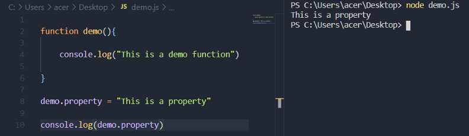
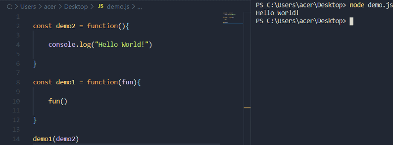
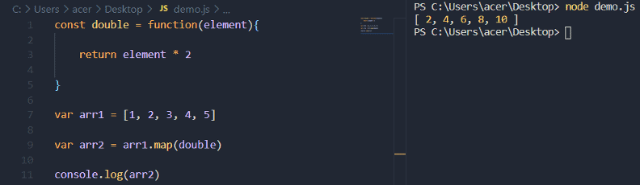
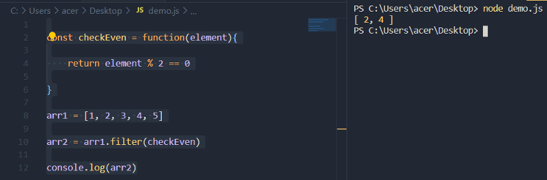
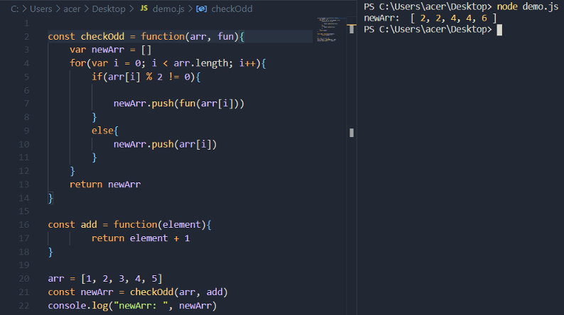

A function is an organized block of code that is created for a specific task. It can accept and return values. The main purpose of using functions is for code reusability and organization. In JavaScript, functions can be considered 'higher-order'. To better understand this term, we need to look at some basic concepts related to JavaScript functions.

## Functions in JavaScript

Take a look at the following code snippet:

```javascript
function demo(){
    console.log("This is a demo function")
}
demo()
```

This is a very basic example of a JavaScript function. The name of the function is "demo" and its prints "This is a demo function!" in the console. We we can do a lot more with this function, including assigning it to a variable, or passing it to another function as a parameter. This is possible because JavaScript is a functional programming language.

Being a functional language, JavaScript treats functions as objects:

```javascript
function demo(){
    console.log("This is a demo function")
}

demo.property = "This is a property"

console.log(demo.property)
```

Just like we add a property to a JavaScript object, a property is added to the "demo" function.



While this proves that functions in JavaScript are treated as JavaScript objects, it's not recommended to use the above approach. This was just a demonstration.

Like numbers and strings, we can assign functions to variables, pass them as a parameter, and even return them from another function. We can do everything with JavaScript functions that is possible with strings, numbers, etc. JavaScript functions are treated as an object, or we can say as first-class citizens. This is the reason why JavaScript functions are called "First-class functions".

Take a look at the following example:

```javascript
const demo = function(){
    console.log("Hello World!")
}

demo()
```

In the above code, a function is assigned to the variable named "demo".

```javascript
const demo2 = function(){
    console.log("Hello World!")
}

const demo1 = function(fun){
    fun()
}

demo1(demo2)
```

This time, "demo2" is passed as a parameter to "demo1" and then it is called inside it.



It is necessary to understand these concepts in order to discuss higher-order functions.

## Higher-order functions

In simple terms, a function that operates on another function is called a higher-order function. The way of operating can differ. The function can be passed to it or returned as an output. There are few in-built higher-order functions in JavaScript. For example, the "map" function.

The map function is one of the most commonly used in-built function in JavaScript. It works on an array and creates a new array from it. The important thing to take away from this is that it operates on a function, thus making it a higher-order function. Let's take a look at an example:

```javascript
const double = function(element){
    return element * 2
}

var arr1 = [1, 2, 3, 4, 5]
var arr2 = arr1.map(double)
```

The above code illustrates the concept of higher-order functions in the simplest way. The "arr1" has five elements. The map function is used to create a new array from "arr1" through the "double" function.

```javascript
var arr2 = arr1.map(double)
```

The "double" function is passed as a parameter to the map function. Here, every element of "arr1" is passed to the "double" function, which in turn is returning its double value.



The takeaway here is how the map function is operating on another function that is passed to it as a parameter. Let's look at another example. The filter function also creates a new array, but only those elements are added to the new array that passes the condition.

```javascript
const checkEven = function(element){
    return element % 2 == 0
}

arr1 = [1, 2, 3, 4, 5]
arr2 = arr1.filter(checkEven)

console.log(arr2)
```

In the above code, the "checkEven" has a condition to the check if a number is even or not. The filter function is operating on the "checkEven" function to create a new arr (arr2) from arr1.



We can also create our own higher-order functions.

```javascript
const checkOdd = function(arr, fun){
    var newArr = []
    for(var i = 0; i < arr.length; i++){
        if(arr[i] % 2 != 0){
            newArr.push(fun(arr[i]))
        }
        else{
            newArr.push(arr[i])
        }
    }

    return newArr
}

const add = function(element){
    return element + 1
}

arr = [1, 2, 3, 4, 5]
const newArr = checkOdd(arr, add)

console.log(newArr)
```

In the above code, the function named "checkOdd" is a higher-order function. The "checkOdd" function has two parameters - an array and a function. The function that is passed to it is named as "add". Now, this "checkOdd" function iterates over the array (arr) and check if each element is odd or even, then appends it to another array named "newArr". If the element is odd, then it is passed as a parameter to the "add" function (which was passed as a parameter to the "checkOdd" function). Then, the "add" function returns the element by adding one to it. In the end, when the iteration is over, the new array is returned.

So the "checkOdd" is operating on another function, "add" that is passed as a parameter to it. Therefore, it is also considered a higher-order function.



The concept of higher-order functions can be confusing. Hopefully the above examples provided enough context in order to understand their usefulness. There are few built-in higher-order functions in JavaScript, including map, reduce, filter (and others). We can also create higher-order functions manually, which was shown above in a simple example.

For more on Higher Order functions, see: Higher-Order Functions :: Eloquent JavaScript
