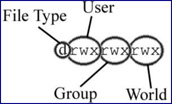
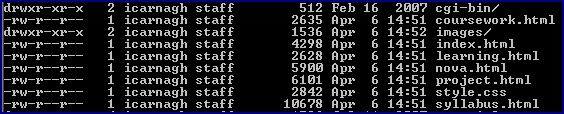

All files and directories created in a Unix environment such as Nova are assigned permissions based on the level of access available to different user groups. In order to understand permissions better, we will discuss users, groups and ownership.

## Users

Unix is a multi-user operating system. It serves many users who have ownership or certain privileges of resources on the system. You have recently set up a Nova account at UMUC and therefore have become one of its users.

## Groups

In Unix, users are organized into groups and one user can become a member of many groups. Groups are used to assign certain privileges and rights to resources within the system which are available to members of the group. For example there may be a web group setup for developers, a staff group giving regular staff access to certain resources and an administrator group for management access.

## Ownership

Any time a new file has been created in Unix, a user and group is recorded as its owner. Owners have full permissions to the file(s) they create.

## Permissions

Every file and directory has an assigned set of permissions which tell the server what can be done and who can do it. There are three main things that can be done with any file or directory:

- **(r) Read** the file or directory (Can be viewed or printed)
- **(w) Write** the file or directory (Contents can be changed or deleted)
- **(x) Execute** or run the file (File can be used as a program / directory can be searched)

The abbreviations r, w and x are used in Unix to refer to these permissions. In addition, (d) is used to illustrate the type of resource, if a d is listed it means it is a directory, otherwise it is a file.

Permissions specify which of the above actions can be carried out by the owner, group and anyone else accessing the file (world). Therefore, when looking at files, each has its set of permissions listed for the owner, group and anybody (world) in that order.



The screen below displays a detailed listing of files and directories generated by issuing the ls -l command. The first set of letters specifies the permission, followed by the number of files, owner, group, filesize, date last edited and name.



In order to understand how permissions are assigned to files and directories let’s look at the first line the screenshot for the cgi-bin directory. There is a series of letters at the beginning which specify the permissions: drwxr-xr-x. Let’s break this down:

**d|rwx|r-x|r-x**

- The d tells us that cgi-bin is a directory.
- The next set of letters rwx tells us that the owner has read, write and execute permissions.
- r-x tells us that the group permissions are read and execute only. (the – is used in place of the middle permission w)
- The final set r-x tells us that anyone else (world) has read and execute permission.

## Assigning Permissions

Permissions can be set in Unix by issuing the change mode ‘chmod’ command followed by a three digit number and the file or directory name. This number sets permissions for all three permissions for owner, group and anyone. In order to understand how these numbers are determined, take a look at the chmod table below:

Each section (User / Group / World) has a number that correlates to its permission setting (whether it can be read, executed, or even written to).

- r w x : 7
- r w – : 6
- r – x : 5
- r – - : 4
- \- w x : 3
- \- w – : 2
- \- – x : 1
- \- – - : 0

So for example, the command:

```
chmod 664 test.html
```

would change the permissions of the file test.html to -rw-rw-r– (rw-) owner (rw-) group (r–) world.

## So What Permissions Should We Use?

Having the proper file permissions set is necessary for serving HTML documents and images on any UNIX server via the WWW. If you try to access a personal WWW page on Nova (or Polaris) and the minimal file permissions are not set for your root directory (ct386f##), your “www” directory, and the page (as a file) itself, then instead of returning with the item, the browser will return an error message. If your web browser ever returns with a response like:

```
403 Forbidden
```

–or–

```
you are not authorized to view this page
```

then you know you’re having a file permissions problem.

When serving web pages, there are really only two minimal file permissions you have to be concerned with, one for directories (world executable) and the other for text, HTML, and image files (world readable).

**World Executable Directories (711)**

In order for web pages on Nova to be accessible by a browser, the permissions of the $root directory of the user serving those pages and that person’s “www” directory, where the pages reside, have to be “world executable.” This can be set with the following command executed in a user’s $root directory:

```
> chmod 711 .
```

(Note the space between the chmod command and 711 as well as the space between 711 and the period)

The permissions can then be displayed using the long form of the “ls” listing (”ls -l”). The permissions of a world executable directory will look like the following:

```
drwx–x–x
```

The important element as far as the web is concerned is the final 1 in 711 or the last “x” in the permission, which means the directory is “world executable”, i.e., anyone (in the world who has access to the system) has access to that directory. This doesn’t mean that anyone can edit files in this directory; all anyone can do is get to the directory.

**World Readable Files (644)**

In addition to setting directory access permissions, web documents and images will still not be accessible unless the minimal www file permission (world readable) is set with the following command:

```
> chmod 711 www
```

and then set for each file

```
> chmod 644 filename.html
```

The long form of the “ls” listing of files with 644 permissions looks like this:

```
> -rw-r–r–
```

The important element as far as the web is concerned is the final 4 in 644 or the last “r” in the long form of the listing, which means the file is “world readable”, i.e., anyone in the world (who has access to the file via the WWW or otherwise) can read it.

_Miscellaneous Notes FYI:_

- Technically, the minimal www file and directory permissions are 604 and 701, respectively (we don’t have to worry about “group” since the “world” has the permission); however, we usually use 644 and 711 permissions because they are easier to remember.
- Minimal permissions are usually discussed when talking about the web. As far as the web is concerned, it is fine to give a webpage or directory more than the minimal permission, such as 755 permissions to an HTML document, for example. The only thing the web cares about is that files are “world readable” and directories are “world executable.” The only problem with giving excess permissions to a file or directory is giving “write” power to someone other than yourself. Unless you are working in a group and you all need to be able to edit the files you should not give write permissions to “group.” And under no circumstances should you ever give write power to “world,” unless of course, you don’t mind taking the risk of anyone editing and deleting your files.
