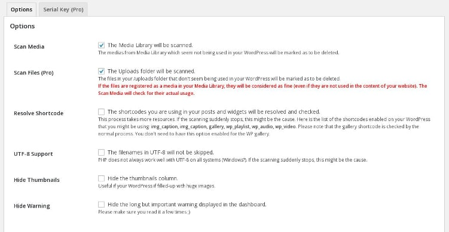
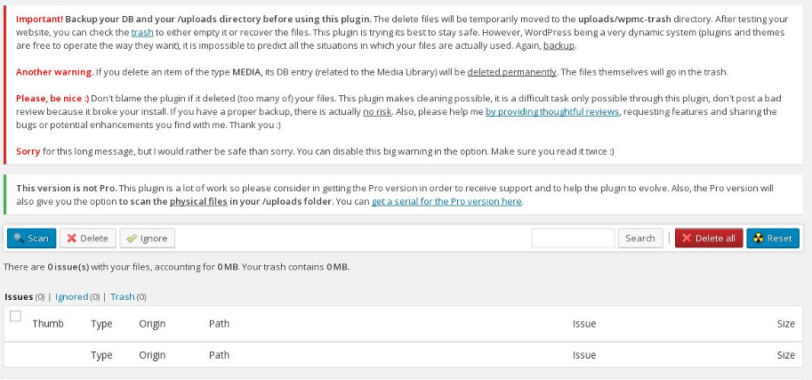

The image is one of the most important elements of a blog post. It not only makes the post attractive but also helps in improving the website's search engine visibility.

Sometimes, when you update a blog post, you may replace the image/pictures in it with some other pictures. Many users don't bother to delete the old images from the uploads directory of wp-content WordPress installation folder.

When a site grows larger, the uploads folder may have tons of unused images. These files waste storage memory, and they impact system's performance. To delete or remove these files, download the Media Cleaner plugin and install it on your WordPress website.

The Media Cleaner is a new plugin on the WordPress.org repository, and it works very well. When installed, this plugin must be configured from its settings page.

In this page, you'll find six check boxes to:

**Enable scanning of media folder**: Users should mark this checkbox as selected as this will enable the plugin's main feature.

**Scan files**: The above function will scan only the WordPress media library. The plugin can scan uploads folder directly. It will check if the upload folder has junk files which are not being used in your WordPress site. This is a pro feature. You'll have to buy a license key to use this feature.

**Resolve Shortcode**: When this option is checked, the plugin will scan each and every media related shortcodes your site is using.

**UTF-8 support**: If your file names have been encoded in UTF-8 format, be sure to select this option.

**Hide Thumbnails**: Media Cleaner plugin will ignore all thumbnails if the user has checked this box.

**Hide warning**: When you open the Media Cleaner tool, you'll see an alert message. If you don't want to see this, make sure that the hide warning option is selected.

**Note**: Before proceeding further, create a backup copy of the WordPress database and uploads folder to avoid loss of data.

Once you've configured the settings, move your mouse on the media option in the WP dashboard and select the cleaner option. To begin cleaning files, click on the scan button.

The plugin will now start scanning your media library to find junk files. Files it has found will be listed on this page. The user should select all unused images after which must click on delete button to free up space in the wp-content uploads folder.

MC Is not the only plugin that claims to remove remaining WordPress images. The DNUI plugin offers similar features. It was updated seven days back. DNUI plugin for WordPress may not work for some users. Such users should try out DNUI alternative i.e. the Media Cleaner.

**Download link**.

**Conclusion**: Many WordPress hosting companies don't offer unlimited storage space to the users. If the SSD or HDD has no room left for new files i.e. pictures, videos, etc, you may not be able to publish new blog posts. In such cases,  you should use the MC plugin to free up space on the server.
