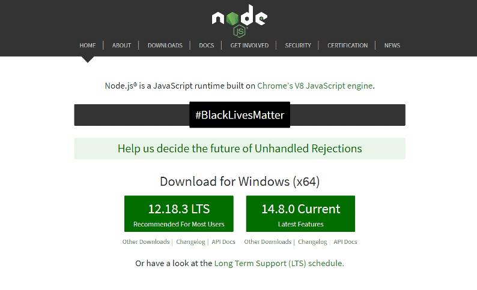
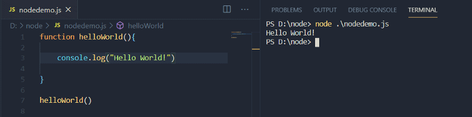
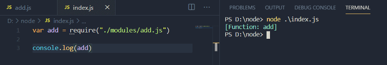
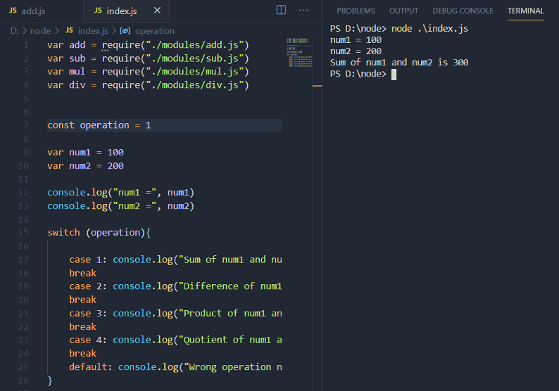
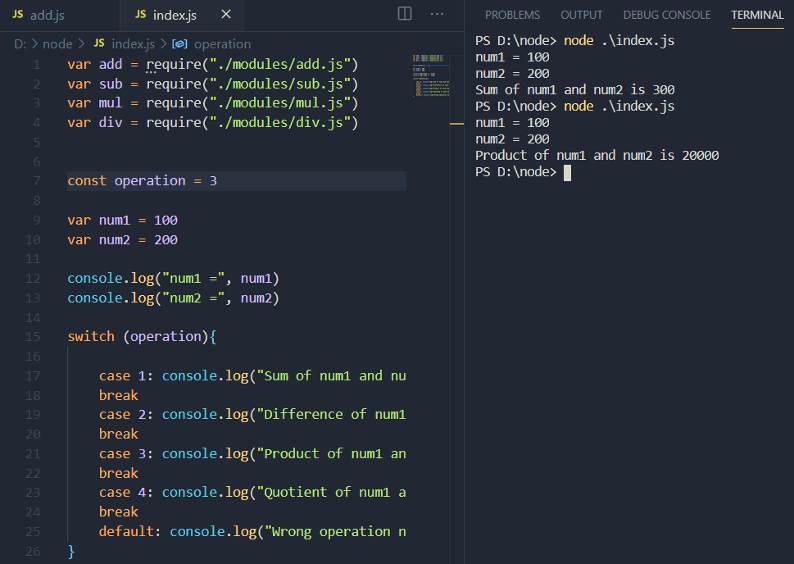
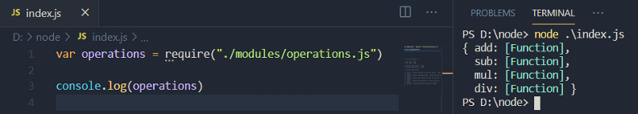
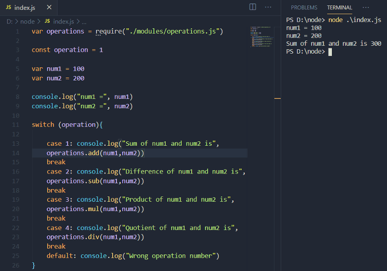
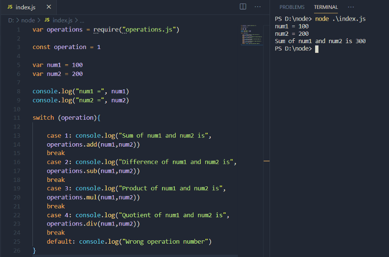
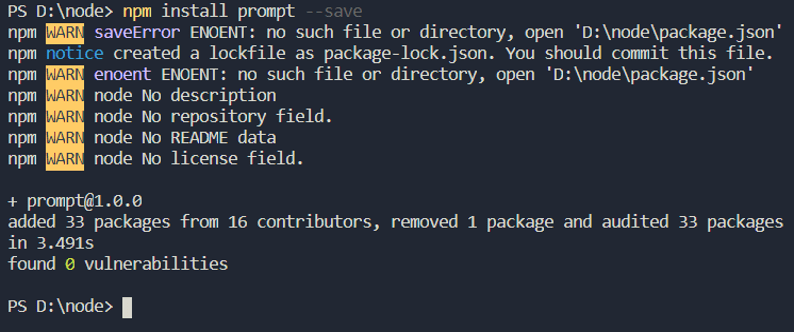
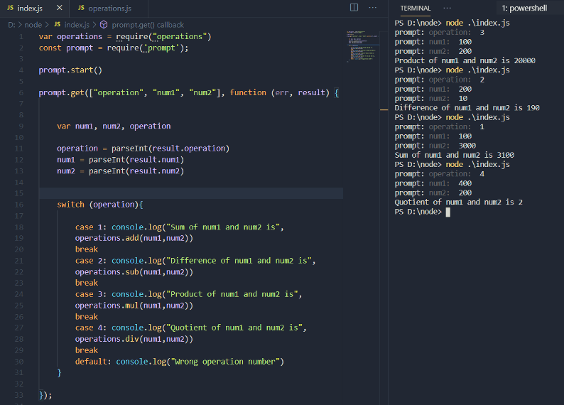

The word "Node.js" is very popular today in the web development community. Everyone is talking about Node.js. The IT giants, startups, everyone wants Node.js developers. But what is Node.js and why it is so popular? Simply put, Node.js is nothing but JavaScript outside the browser. Yes, you read it right. Node.js is JavaScript that runs outside the browser. Not much difference, right? But no doubt, Node.js is one of the most popular "language" today. So in this article, we will discuss everything about Node.js. Before we jump to node.js, let's talk about JavaScript first.

## JavaScript

JavaScript, along with HTML and CSS is a core technology of the World Wide Web(WWW). Today, no website is possible without JavaScript. It is JavaScript that transforms a static website into a dynamic website. For example, we can create a simple button using HTML and beautify it using CSS. But to make it work, i.e. to do something when clicked, we need JavaScript.

JavaScript is a high-level, dynamically typed multi-paradigm single-threaded interpreted programming language. By dynamically typed, it means, variables in JavaScript can hold any data type at any time. It is single-threaded because it runs line by line or synchronously. JavaScript is interpreted, meaning, the code does not compile at once.

JavaScript runs in a browser. Every browser comes with a JavaScript engine, or simply JavaScript interpreter. The JavaScript engine of the most popular web browser, Google Chrome is called V8. Note this line. This is where the concept of node.js starts with.

> According to the StackOverflow 2020 surveys, JavaScript is the most popular programming language among all respondents as well as professional developers.

The result was the same in the year 2019. JavaScript is indeed the most popular programming language in the world. Half of the credit for its popularity goes to Node.js.

## What exactly is Node.js?

Many people fail to understand what exactly Node.js is, especially beginners. As mentioned earlier in this article, Node.js is JavaScript outside the browser. Many categorize it as a JavaScript runtime environment. But to understand it properly, we need to take a closer look.

We know JavaScript is a language for the web. JavaScript was never meant to be what it is today. It was just a scripting language while the heavy work was done using Java. But as time passed, the developer realized how efficient JavaScript is. JavaScript runs in the browser. What does this mean? Remember the JavaScript engine we discussed briefly in the last section? Everything is done by such JavaScript engines.

In simple language, a JavaScript engine executes the JavaScript code, which is passed to it by a browser. More simplified, the JavaScript engine is used by a browser to execute the JavaScript code. Every browser has a JavaScript engine: Google Chrome has the V8 engine, Safari has JavaScriptCore, and Firefox has SpiderMonkey.

Now we know the relation between a browser, JavaScript engine, and the JavaScript code. A point to be noted - JavaScript has nothing specifically for the web or no APIs associated with it. Just observe the following code.

```javascript
var element = document.getElementById("id")
```

If you have used JavaScript, you may know what is the above code doing. It is actually accessing an element in the "document" using the getElementById method. This is a tricky part. JavaScript has no APIs associated with the web, right? Then what is this "document" and how JavaScript can access it?

The JavaScript engine has a library. This library allows the JavaScript code to access arbitrary objects, such as documents. The object, the document is a built-in object, that is not a part of JavaScript. It is present in the web APIs that exist in the browser. Let's simply it more. So the object is added to the environment which is executed by the script and this object is accessible to the JavaScript. Now when the same object is used in the plain JavaScript code, the engine knows which the corresponding object is used here. This is all about the implementation of a JavaScript engine.

Now we know what happens in a browser when a JavaScript code is executed. It is a JavaScript engine which plays a vital part. This is where the developers realized, why we cannot use the same JavaScript engine outside the browser to do something similar which it does inside a browser? A browser has its APIs, why not create some specific APIs to use outside the browser? So this is how node.js was created on the Google Chrome's V8 engine, but outside the browser with its own APIs.

If you understand everything mentioned above, you may have realized, node.js is very straightforward. Instead of JavaScript with browser APIs, it is JavaScript with Node APIs.

## Getting Started

Let's start by installing node.js. Go to the following link: https://nodejs.org/en/



Download the suitable version and install it. The installer will install the node as well as the Node package manager, commonly known as NPM. We will talk about NPM later, but first, open the terminal and type the following commands.

```bash
node -v
npm -v
```

This will show the latest version of Node.js and NPM.

Let's create our first Node.js program. Choose any text editor. I am using Visual Studio Code.

The following code simply prints "**Hello World!**" in the console.

```javascript
function helloWorld(){
    console.log("Hello World!")
}

helloWorld()
```

If you know JavaScript, then you know the above node.js code is nothing but plain JavaScript. It has a function, "helloWorld", that has a console statement and then, there is a function call.

I have created a file named "nodedemo.js" in the "node" folder. Every node file should have .js extension. Let's execute the file and see the results.



## Working with modules

In the real-world, node applications are not this simple. There are many files, several scripts, and modules. Simply said, the application is divided into several different parts. There are a lot many things such as modules, importing modules, exporting modules, packages, and many more. We will create a simple calculator application in node.js step by step discussing all the necessary concepts.

Let's start with the modules.

So what is a module? It is a very common term in Node.js. As mentioned above, an application is divided into several parts. We may have functionalities that are expected to be used again and again. So instead of writing the same code, again and again, **a module is created and the functionality is exported from it**. Then, the module is imported in the required file to use its functionality.

Our calculator will have four basic operations - addition, subtraction, multiplication, and division. Let's create a module that will add two numbers.

In the "node" folder, create another folder and name it "modules Now in the modules folder, create a new JavaScript file and name it "add.js".

**node/modules/add.js**

```javascript
const add = function(x,y){
    return x + y
}

module.exports = add
```

The function may be familiar to you as it is plain JavaScript. But observe the last line, which is exporting the "add" function so that it can be used in some other file. Now, go back to the "node" folder and create a new file, "index.js". This will be the main file.

Let's import the "add" module in it using the "require" function.

**node/index.js**

```javascript
var add = require("./modules/add.js")
```

Check the string in the require function - "./modules/add.js". This is the path of the "add" module from the "index.js" file.



In "index.js", a console statement is used to print the imported module. As you can see, the "add" variable in the "index.js" file is a function. So we can use this variable (add) as a function in the "index.js" file.

Similarly, we can create each module for subtraction, multiplication, and division.

**node/modules/sub.js**

```javascript
const sub = function(x,y){
    return x - y
}

module.exports = sub
```

**node/modules/mul.js**

```javascript
const mul = function(x,y){
    return x * y
}

module.exports = mul
```

**node/modules/div.js**

```javascript
const div = function(x,y){
    return x / y
}

module.exports = div
```

We now have four modules - add, sub, mul, and div, and all these are required in the "index.js" file.

```javascript
var add = require("./modules/add.js")
var sub = require("./modules/sub.js")
var mul = require("./modules/mul.js")
var div = require("./modules/div.js")
```

Next, we need to make some modifications in the "index.js" file.

```javascript
var add = require("./modules/add.js")
var sub = require("./modules/sub.js")
var mul = require("./modules/mul.js")
var div = require("./modules/div.js")

const operation = 1

var num1 = 100
var num2 = 200

console.log("num1 =", num1)
console.log("num2 =", num2)
switch (operation){
    case 1: console.log("Sum of num1 and num2 is", add(num1,num2))
        break
    case 2: console.log("Difference of num1 and num2 is", sub(num1,num2))
        break
    case 3: console.log("Product of num1 and num2 is", mul(num1,num2))
        break
    case 4: console.log("Quotient of num1 and num2 is", div(num1,num2))
        break
    default: console.log("Wrong operation number")
}
```

There are three variables in the above code - operation, num1, and num2. The "operation" variable will define the type of operation to be performed while num1 and num2 are the values passed to the modules. Then, we have a switch statement that will help in choosing the operation accordingly. Currently, the above code is static. The value of "operation" is 1, meaning, the num1 (100) and num2 (200) will be added.

Let's execute this code and check the result.



It works as expected! The sum of 100 and 200, i.e. 300 is printed in the console. Let's change the value of "operation" to 3 and execute the code again.



If we think like a professional developer, we can conclude that the job can be done by creating a single module for all the four operations instead of four different modules. Currently, each module is exporting a single function, but we can also export multiple functions from a single module. This approach is more efficient.

In the "module" folder, create a new file and name it "operations.js". This file will export all four functions.

```javascript
exports.add = function (x,y){
    return x + y
}

exports.sub = function(x,y){
    return x - y
}

exports.mul = function(x,y){
    return x * y
}

exports.div = function(x,y){
    return x / y
}
```

This time, we did not use "modules.export", instead we used the "exports" keyword to export each function specifically. Now let's import it in the "index.js" file and check what is being exported.



The module is returning an object and in this object, we have all the functions that are exported from it. Let's modify the "index.js" file to make it work properly.

```javascript
var operations = require("./modules/operations.js")

const operation = 1

var num1 = 100
var num2 = 200

console.log("num1 =", num1)
console.log("num2 =", num2)

switch (operation){

    case 1: console.log("Sum of num1 and num2 is", operations.add(num1,num2))
	break
    case 2: console.log("Difference of num1 and num2 is", operations.sub(num1,num2))
	break
    case 3: console.log("Product of num1 and num2 is", operations.mul(num1,num2))
	break
    case 4: console.log("Quotient of num1 and num2 is", operations.div(num1,num2))
	break
	default: console.log("Wrong operation number")
}
```

Let's execute the code and see the results.



Up until now, we learned some major, important concepts related to Node.js. We discussed how to create modules, import, and export them. This may seem basic, but it is a very important concept. Moreover, when you will work in a real node application, you will realize the importance of modules.

## Working with packages

Packages are another important concept. A package is nothing but containing modules. Well, the "modules" folder is a kind of package but with a little problem. When a package is imported, it does not require a path. But we used the paths while importing the module, right? But when an application grows, the paths of modules can also grow. It is not an efficient way to import a module with a long path. So we have an approach with the package which omits the use of paths while importing a module.

Instead of this:

```javascript
var operations = require("./modules/operations.js")
```

We can do, this:

```javascript
var operations = require("operations.js")
```

But how? Let's discuss this. When a module is imported, node first search in a directory called "node\_modules", then in the current directory. So all we need is a new directory with the name "node\_modules" in the "node" folder and shift the "operations" module in it. Let's move the file and make the change in "index.js"

The path of "operations.js" is - node/node\_modules/operations.js

**node/index.js**

```javascript
var operations = require("operations.js")

const operation = 1

var num1 = 100
var num2 = 200

console.log("num1 =", num1)
console.log("num2 =", num2)

switch (operation){

    case 1: console.log("Sum of num1 and num2 is", operations.add(num1,num2))
	break
    case 2: console.log("Difference of num1 and num2 is", operations.sub(num1,num2))
	break
    case 3: console.log("Product of num1 and num2 is", operations.mul(num1,num2))
	break
    case 4: console.log("Quotient of num1 and num2 is", operations.div(num1,num2))
	break
	default: console.log("Wrong operation number")
}
```

Now, the operations/js" module is imported directly without any path. Let's execute the code.



The code works as expected and demonstrates how packages are used.

## Node Package Manager

There is one problem with the calculator we created - It does not ask for user input. Well, what is the use of a calculator if it can not take user input? Hold on, we will discuss this at some time. First, we need to discuss Node Package Manager, NPM.

We can create our own modules and packages, but is it possible to do this for every functionality? There are lots and lots of functionalities which we may not able to create ourselves. For example, the input functionality for the calculator. We can look for the code on Google and paste it in our code, but is it an efficient way? No, not at all. There are 3rd party packages, hundreds and hundreds of these packages have almost everything a developer needs, and the best part - no copy-paste is required.

We have Node Package Manager, or commonly known as NPM for this. Node community is huge and developers have created several packages which are useful in many ways. These packages are available in NPM.

The Node Package Manager is installed automatically when node.js is installed.

Coming back to the calculator. We need functionality for user input. We have two third-party packages for this - readline and prompt. We will use the latter.

NPM has everything. We only need to install the package and then we can use it in our application. The following is the syntax to install a package locally.

```bash
npm install <package-name> --save
```

Let's install the "prompt" package.



Now we can simply import this package in the "index.js" file using "require" and use it.

```javascript
var operations = require("operations")
const prompt = require('prompt');

prompt.start()

prompt.get(["operation", "num1", "num2"], function (err, result) {

    
    var num1, num2, operation

    operation = parseInt(result.operation)
    num1 = parseInt(result.num1)
    num2 = parseInt(result.num2)
   

    switch (operation){

        case 1: console.log("Sum of num1 and num2 is", operations.add(num1,num2))
        break
        case 2: console.log("Difference of num1 and num2 is", operations.sub(num1,num2))
        break
        case 3: console.log("Product of num1 and num2 is", operations.mul(num1,num2))
        break
        case 4: console.log("Quotient of num1 and num2 is", operations.div(num1,num2))
        break
        default: console.log("Wrong operation number")
    }

});
```

In the above code, we have imported the package and use two methods - start and get. Well, explaining the package is of no use right now but let's discuss briefly what is happening here.

The "operation", as well as "num1" and "num2", do not have static values. Instead by using the "prompt", we taking input from the user.

```javascript
operation = parseInt(result.operation)
num1 = parseInt(result.num1)
num2 = parseInt(result.num2)
```

Don't get confused by "parseInt". The input is taken as a string but we need int values. So the "parseInt" method is used to convert the string into an integer. Everything is else is the same.

Let's execute the code.



Now it looks more like a calculator.

## Wrapping it up

The emergence of node.js immensely increased the popularity and importance of JavaScript in the web development community. Before node.js, JavaScript was a huge name in client-side development and when node.js came out, JavaScript rapidly made a place in server-side development also. Today, a web developer should be comfortable with both client-side and server-side. Earlier, developers had to learn different languages for client-side development and server-side development. For example, JavaScript for client-side development and PHP for server-side development. But with node.js, these extra requirements can be prevented.

In this article, we discussed node.js from the very beginning. Many people have misconceptions regarding the actual meaning of node.js, but I tried to explain it in depth. Then, we discussed modules and packages with a simple practical example. Modules and packages are an essential part of node.js. When you will work on a real node.js project, you will realize everything revolves around modules and packages. Another important part is the Node Package Manager. Though it is not a tough challenge to understand NPM, but whenever you say "node.js", NPM always comes with it. So it is necessary to learn everything about this package manager.

Node.js is a core part of the MEAN and MERN stacks. These stacks include technologies such as Angular, React, Express, and MongoDB, and of course, Node.js. There is a huge demand for full-stack developers, and if you want to enter the web development community, you should go for these web development stacks. And the very first step is node.js
