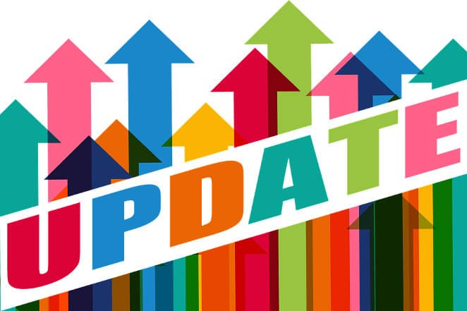

Themes and plugins are the most important parts of a WordPress website. If the code of the theme is not SEO friendly, your site will not perform well in search engines. Likewise, if the plugin has an erroneous code, it can lead to poor user experience.

In worst cases, the problematic theme or plugin may cause high server resource utilization. The search bots will begin to ignore your site. If you don't fix the problem ASAP, the site's rankings will tank.

Bloggers are always excited when they see a new update for the product they have paid for. For example, if you own the Genesis Framework, you'll be excited to see an update for your child theme or framework. Similarly, if you see an update for a popular SEO plugin you have installed on your site. You go ahead to update it.

Because of problematic code, the plugin strips off the title tag and meta description from the header. Google finds the changes you've made to the website and it indexes the pages. Moreover, you don't bother to check whether the plugin is working as expected or not.

The HTML section of the Google search console will show loads of errors. Furthermore, search engine users won't be able to find your site. If the page generates revenue for your site, your earnings will drop.

### How to update WP plugin or theme safely?

To ensure that your site doesn't get affected by a badly coded plugin or theme, you should always turn maintenance mode on before running an update.

Yes, that's right! Updating a theme or plugin on a live site can be suicidal. We have shared some good examples for the same.

I use the free Maintenance Mode plugin on one of my sites \[download link\]. The plugin works like a charm. It has a settings page where you'll find a checkbox to enable or disable the maintenance mode which makes users and the search engines aware that your site is being updated.

By default, the WP MM throws HTTP 503 service unavailable error and shows a message that your site is under maintenance. If you want, you can customize this message. You can add an image, hyperlinks to the template.

If you're launching a new site, you can configure the plugin to show coming soon page instead of the maintenance template. The option to enable the same is located under advanced settings.

The plugin enables you to preview the coming soon or maintenance mode template. It is very easy to use.

**Conclusion**: I hope you guys have understood the importance of the WP maintenance mode. Make sure that you install the plugin and activate the MM template before running an update.

Image source: Geralt
