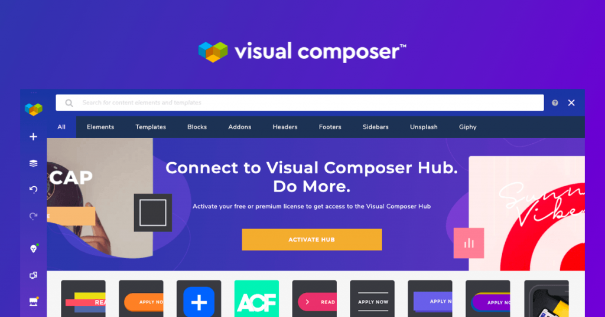
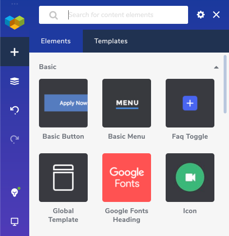
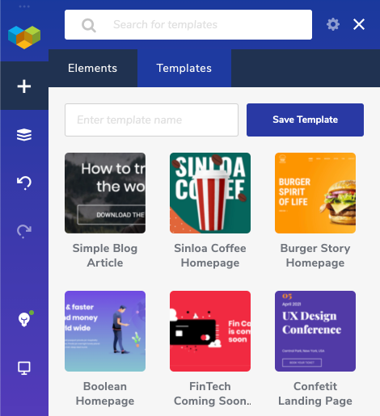
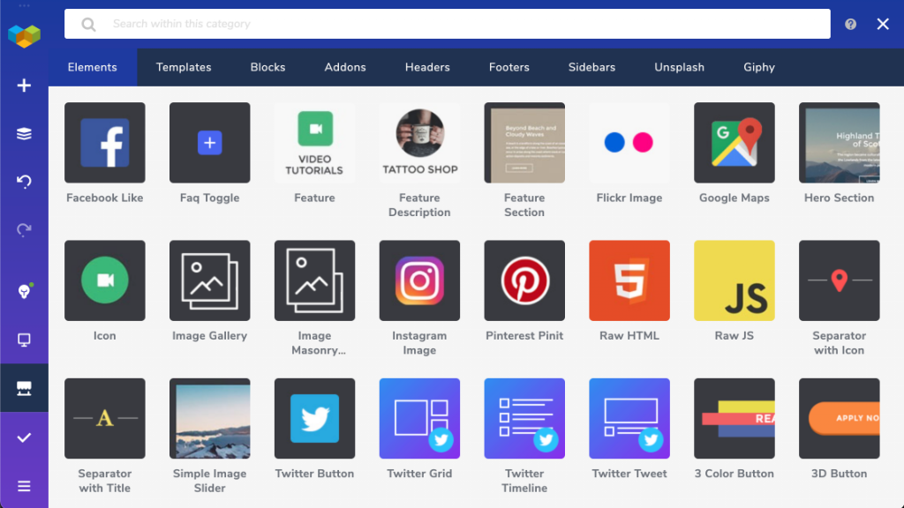
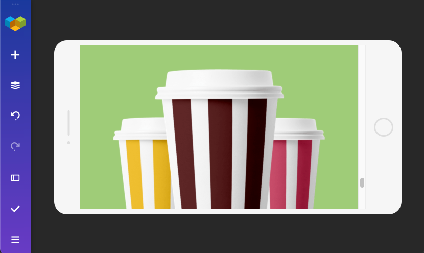

Visual Composer is a drag-and-drop WordPress website builder that makes it easy for anyone to create beautiful layouts without touching any code. It's perfect for people who want to design their own websites and don't have the time, knowledge, or patience to learn how to use complicated website building tools. You can customize your site with Visual Composer in a few clicks or by choosing from one of its prebuilt templates.

Visual Composer has a free and a premium version. The free version will give you just enough to create a simple website, but most of the magic happens with the premium version. You can check out the full comparison here.

This article will give you an overview of how it works and its features. We'll take a peek at the interface too so that you can decide if it's right for your site!

### Content Elements

The building blocks of Visual Composer are content elements. From simple buttons and text blocks to timelines, post grids, and testimonials. Visual Composer is equipped with a wide variety of these elements and they're adding new ones regularly.

There are also multiple compatibility elements available so that you can work with Visual Composer and other popular WordPress plugins seamlessly. At the moment, you can find special compatibility elements for plugins like WooCommerce, Slider Revolution, Caldera Forms, and many more.

### Templates

One of the most convenient things for starting building a site is that you don't have to start from scratch. Visual Composer has a ton of premade templates and template blocks that you can use to get you started.

You can find templates by certain industries like restaurants, beauty, real estate, portfolios, as well as by the type of page you are looking for, like a landing page, blog article, testimonial page, etc.

### **Visual Composer Hub**

The Visual Composer Hub is a place where you can find additional content elements and templates, you can also get addons like the Header and Footer Builder, Global Templates, and many more. And also a cool addition to the Hub is the Unsplash stock image and GIPHY integration.

The hub will be a big help in your site creation and will help your design be up to date, as there are new elements, templates and addons added all the time. To get unlimited access to the Hub, you can get the Premium subscription here.

### **Header, Footer, Sidebar Editor**

With Visual Composer Theme Builder, you are not stuck with your theme’s default header and footer. You can create your own custom header, footer, and sidebar using the tools that Visual Composer offers. 

Also, don't forget about the premade templates here. You can just choose the one that you like and customize it to your liking.

### **Responsiveness** 

One of the strong points about Visual Composer is that it makes designing responsive websites incredibly easy. It's possible to preview and fully design a website on any electronic device, switch between devices at will, and even publish once you're satisfied with your work!

In the frontend editor, you can see how your site adapts to devices like mobile and tablet. Then you can adjust each device manually if needed.

## **In Summary**

Forbes has listed Visual Composer as one of the must-have WordPress plugins for your business website because of its design freedom, powerful features, and ease of use. But you won't know before you try it out for yourself, so you can start free or jump straight to the Premium to unlock all valuable features. 

Already using Visual Composer? Share your experience with us.
