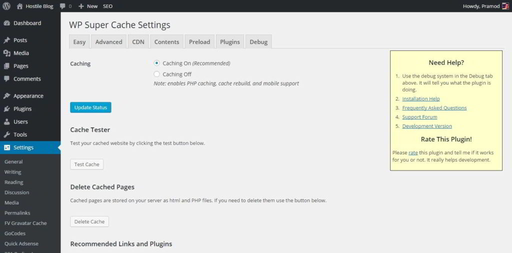
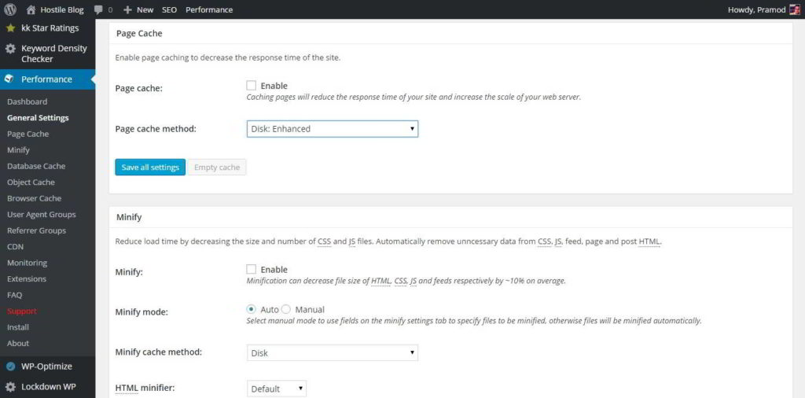

Caching is one of the most essential and advanced techniques for improving the performance of websites and reducing server resource usage.

Sites using this technology are fast, and they yield pretty good results when tested with GTmetrix or Pingdom tools.

WordPress has been the backbone of many powerful and established websites with 1000s of posts. To make their sites more powerful, the user should install the best third party plugins (including a caching system).

When you install a caching plugin, the WordPress site will load faster, and it will offer a good experience to the user.

W3TC and WPSC are the 2 of the most downloaded and used free WordPress plugins. When people launch a new site or want to add a caching system to their existing websites, they'll get confused because these two plugins are excellent and choosing one comes difficult. Today, we'll share the differences between W3 Total cache and WPSC so that you don't have to spend time in thinking which plugin is better than other plugins:

## WPSC (WP Super Cache):

WordPress SC is the simplest plugin for caching. It has a settings page with easy to understand options. The configuration section has been divided into the below eight tabs:

### Easy

This page allows you to enable and test caching system. You can also delete the cached files and content with the easy tab.

### Advanced:

This page allows users to enable PHP, Legacy and mod\_rewrite caching. You can enable the gzip compression module. When this module is active, your HTML files will be sent to the user's browser in a compressed format to improve the loading time of the pages.

This page lets users set 304 not modified header, specify caching location and enable mobile device support for nonresponsive websites using third party plugins like WP Touch, Jetpack mobile themes. You can enable lockdown module and restore optimal super cache settings through it.

You can add expiry time and garbage collection for your website pages through an Advanced section of this free plugin.

### CDN:

If you're using a content delivery network (like CloudFlare, CloudFront, MaxCDN), this page will allow you to enabled compatibility between WP Super Cache and your content delivery service provider.

### Preload:

If you have a large site, the preloading feature will reduce a lot of load on your server as it will create a static version of each page of your website. Instead of loading text content, URLs from WordPress database, the static files will be served to the user or search engine robots. Preloading feature in WordPress super cache is disabled by default. You will have to enable it.

## W3TC (WordPress Total Cache)

### Minification support:

This module will minify the JavaScript, CSS and HTML content of your WordPress website. Minification is important because it can reduce page load time considerably. W3TC includes this feature, but it doesn't work. I've tested this module with two premium and many free WordPress themes; it breaks the site when auto-minification is enabled. If you want to use this feature, open the minification settings page and add javascript, CSS URLs manually.

### Caching:

Wordpress total cache allows its users to enable database, page, object caching modules. The plugins support opcode, APC, and Memcached technologies. When you install W3TC, it will check if your website hosting service provider is enabled with these two features. If they're not available, you'll have to rely on disk caching (enhanced or basic).

### Browser cache:

This module allows you to specify the expiry time for cached contents and enable the gzip compression. You can also set entity tag, file not modified, cache control headers and disable the set cookies option for static files.

Other features are same as found in WPSC.

### Top 3 reasons why WP super cache is better than W3TC:

**Ad-free**: I have not seen any ads in the plugin's setting page till date. Many people avoid free plugins with ads, and I'm one of them.

**Easy to configure:** Its very easy for the user to enable the caching system in the WPSC plugin. You just have to check the boxes with recommended settings. That's it!

**Compatible with many premium plugins:** I had tough times in configuring easy social share buttons plugin to work with W3TC. To continue using ESSB, I had to get rid of the total cache. ESSB was working well with WPSC.

### When should you consider using W3TC

**Hosting on VPS or dedicated servers**: If your website is hosted on a powerful server with lots of RAM, you can easily activate and use powerful features like Memcache, DB caching, etc. This module will improve the load time of your website considerably. Dedicated and VPS hosting is used by large blogs with millions of visitors. If you own a large internet site, W3TC is the best caching that you can use.

**Minification**: If you want a caching +minification solution then W3TC is an excellent plugin to consider.

### Conclusion:

I've not used any benchmarking tools to analyse the performance of these two plugins. The website load time depends on many factors and is caching is a technique to improve it. A plugin which is easy to configure saves your time. Thus I think WP Super Cache is better than W3TC. Minification is not required in many cases. If you to use this technique, configure CloudFlare, and it takes care of the rest. You can also use Autoptimize along with super cache.

W3TC has many options. Thus if you have a large website, it will be a perfect choice for you.
