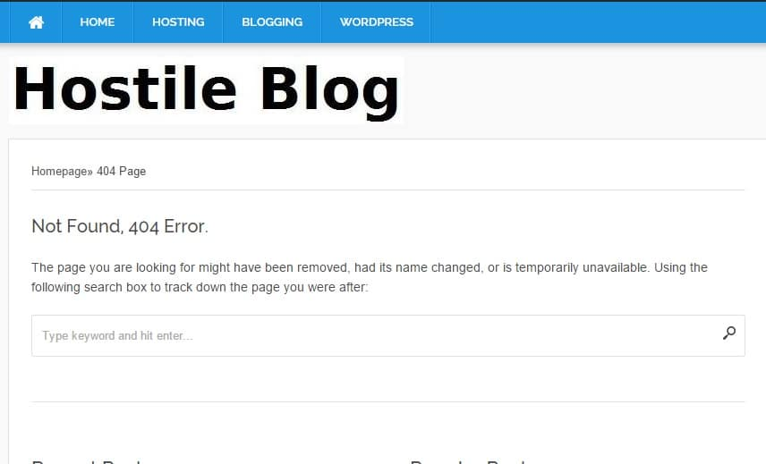
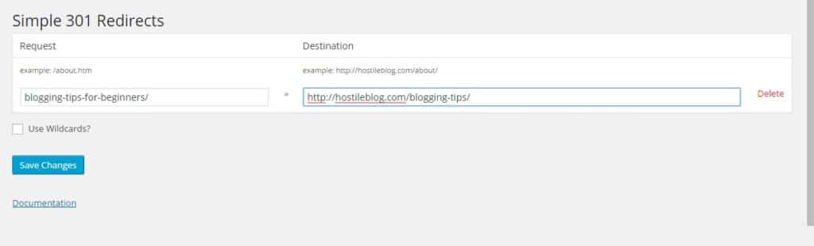

404 errors in WordPress is caused when a user or a search bot is not able to find a page on your site. This page might be linked from your blog post or another website. According to Google webmaster tools, these errors won't affect your site's performance in the search engine, but you should try to get rid of them for a better user experience.

Sometimes, a lot of WordPress 404 errors can do more harm than any other factor. For example, the bounce rate will be very high as users didn't find the page they wanted to access, they'll hit the back button of the browser immediately without spending much time on your blog. Thus it's a good idea to get rid of 404 errors. You can use the below tips and plugins for the same.

### Broken Link Checker

This plugin will scan all the articles that you have published to find broken links (404 error causing pages). You'll find the broken links in WordPress dashboard or under is tools option.

BLC plugin allows you to set max execution time and CPU usage. If your blog is hosted on a platform that is too conscious/strict about its resource usage, keep the execution time below 20 and server CPU consumption under 0.5. BLC supports fixing of broken links. It is a must have WordPress plugin.

### Find source

Use Google webmaster account or backlink checker tool to locate the source because search engines might be detecting the link to your post from other blog or website.

When you find the source, use whois tool to get the webmaster's email address and drop him a mail to remove the backlink. If the webmaster takes no action, use the below plugin.

**Note**: If you've deleted the page as it was linked to a spammy site or you've paid someone to insert it in their blog posts, don't redirect it. Let the CMS throw 404 error.

### Simple 301 redirects

Redirecting a broken link to the new and relevant article with the HTTP 301 code will make sure that the link juice is passed to the new page (in case if other site links it). This plugin is easy to use.

To use this plugin, you need a list of all WordPress 404 error links. Google webmaster tools is an excellent starting point for this. Open GWT and click on crawl errors link under the crawl menu located to the left side. Google uses separate robots to find web pages. Thus the 404 errors will appear on the desktop, smartphone as well as mobile tab.

Copy all the URLs to an excel file. Find and remove the links that you've deleted purposefully to avoid Google penalty. Now install simple 301 redirect plugin and open its settings page. Add the 404 URL in the 1st row of the column and add the link to which the broken permalink should redirect to the 2nd column. The next row will appear only click on the save changes button.

In case you're getting soft 404 errors in the webmaster tools dashboard, find the page which is responsible for the same. These errors are thrown when an empty or blank page, instead of throwing 404 not found errors, generates 200 HTTP OK status.

Soft 404 errors have a more adverse effect than standard 404 errors. Make sure that you fix them immediately. Check this page on Google webmaster central blog for more information.
