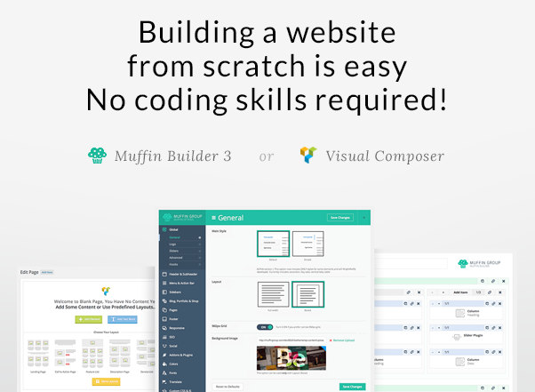
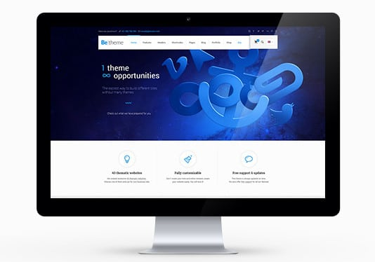
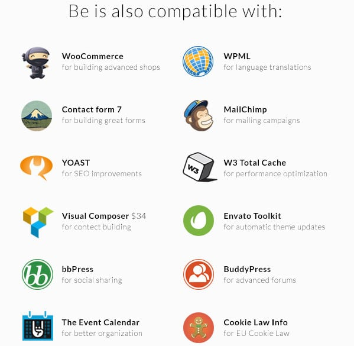

The BeTheme is a responsive multipurpose WP Premium template compatible with BuddyPress, WooCommerce, Gravity forms, BBpress, and many other premium WordPress products. It works on IE9 to IE11 browsers and other top web browsers such as Google Chrome, Opera, Safari, etc.

BeTheme has over 45000 users. It is one of the best-selling paid WordPress themes of all time and the best product from top WP development firm Muffingroup.

If you're looking forward to buying a WordPress Theme which you can model into any type of website, then you should check out the BeTheme.

The developers of BeTheme introduce theme demos which allows users to launch a website with predefined settings within few minutes.

### Muffin Builder

WordPress BeTheme is powered by the Muffin Builder 3 tool. MB3 Is a drag and drop page builder for WordPress. It works great with the BeTheme. It lets you drag and drop powerful HTML elements to their desired positions on a page.

MB3 packs over 35 stylish HTML components. It includes over 199 unique elements to make your site more user-friendly and awesome.

The Muffin Builder works with pages and posts. Like the Divi Theme Builder, it lets users change size and style of the elements supported by it.

See demo or download BeTheme

### Responsive

WordPress BeTheme is a responsive template which renders perfectly on all types of desktops and mobile devices. The theme provides users the option of turning off responsiveness.

### Customization

Apart from the MB3 tool, BeTheme offers a settings panel where you can:

- Change the color of your favorite elements.
- Enable or disable box layout.
- Turn on or off the full-width layout.
- Activate fix header menu or disable it.

The BeTheme allows users create as many sidebars as you want. It allows you to enter custom CSS code. The WordPress BeTheme lets you to showcase your work portfolio. It provides four different layouts for the same. BeTheme has the option to change fonts in pages and posts. It supports Google Fonts.

Adding logo and favicon to WordPress BeTheme is a piece of cake through the theme settings page. The WP template offers six customized widgets and over 18 header styles. It supports megamenu navigation system.

The WordPress BTheme packs a powerful shortcode generator that lets users generate over 150 elements. Once you generate a shortcode, you can place it on any page or post.

Because of its powerful features, you can easily build one-page websites with the BTheme.

Download or see demo of BeTheme

### SEO

If you don't like to use the best WordPress SEO plugins, then BeTheme provides SEO fields which you can enable or disable as per your requirements. Additionally, you can disable the fields and configure your favorite SEO plugin to make website search engine friendly. BeTheme has the breadcrumbs module built-in.

### Prebuilt pages

WordPress BeTheme packs the following predefined and stylized pages.

- Career, contact, about.
- Press release, pricing, features.
- Gallery, 404 page, maintenance mode and more.

The prebuilt WordPress pages save several hours of its users.

### Interesting features

Other interesting modules that the WordPress BeTheme offers are as follows:

- Support for Google maps, sub-pages, grid layouts.
- Social media icons, footer menu customization.
- Code commented to help the user understand what the code does.
- Over 200 free vector icons.

Conclusion: WordPress BeTheme is a powerful theme, with which you can build any type of site. Check its full features here on ThemeForest.
