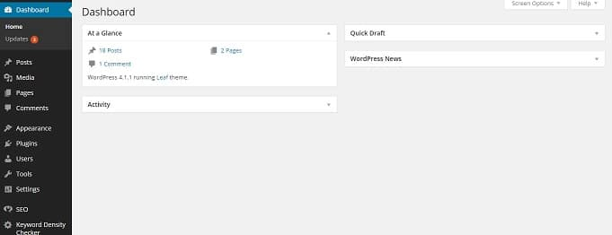

WordPress is no doubt better than many other blogging platforms. As it is a self-hosted CMS, you'll have to manage the site yourself. When you encounter technical issues, you or any other person with good knowledge of PHP, WP, htaccess, CSS should solve the problem. Blogger is user-friendly but it cannot be customized as WordPress. Technical issues in Blogger platform is handled by Google engineers.

Today, we'll share 3 working solutions to one of the most frustrating WordPress issue i.e. locked or slow dashboard. If your WordPress site's dashboard is not working, loading or showing up or if it is loading slow, don't worry! Just follow the below instructions to restore access to the dashboard.

## Fixing WordPress dashboard issues

**Disable caching:** Caching is the main reason why many webmasters see a blank page instead of WordPress dashboard. If you're facing this issue, deactivate WP-Super cache, W3TC, WP-fastest cache or any other WordPress plugin. To deactivate, simply navigate to WP-Plugins folder by opening the file manager through your hosting's Cpanel tool.

When you find the plugin folder, rename it. This will turn off WordPress caching. Now, find and delete cache folder in the wp-content directory. Blank page in WordPress is a strong indication of poor server specifications.

To avoid this problem in the future, make sure that you switch to another hosting provider. We recommend you to sign up with Hostgator or Bluehost.

**Disable all plugins:** If the above method doesn't work for you, open the CPanel or log into the VPS, find the wp-plugins folder in wp-content folder and rename it. Now, open the login URL of your WordPress site, enter your username, password or mail address and click on submit button.

WordPress dashboard will now show up. This indicates that a plugin is conflicting with another plugin which in turn is blocking WP-Admin.

To get rid of the problem, you'll have to find the problematic plugin. Restore the original name of the plugin folder. Now, rename all the folders in the plugin directory and restore the name of the 1st plugin and try to login to your dashboard.

If the dashboard is working, this plugin is not causing any problem. Repeat the above step for all the plugins. If you find the problematic plugin, remove it. If this doesn't solve the issue, follow the next method.

**.htaccess file (when WordPress dashboard or WP-Admin redirects to 404 not found page or any other post):** Open the root directory of your hosting provider and open the .hatccess file. Now, search for the code containing the wp-admin word.

Remove this code and save the .htaccess file. Open your login URL and try to sign into your account. If the dashboard shows up, your problem is solved. In case the htaccess file doesn't have the wp-admin word, open the directory where WordPress has been installed and check for the existence of the wp-admin PHP file.

If the file is absent, download WordPress installation file to your desktop. Extract the file and upload the wp-admin file to the WordPress installation directory.

If the wp-admin file exists, re-install WordPress. This will replace all old and corrupt installation files. Before installing WP again, backup your DB and all theme, image files.

I hope that you've found these 3 solutions useful.
