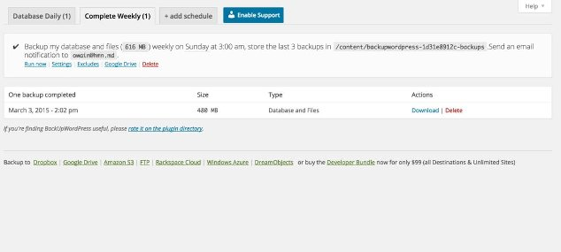
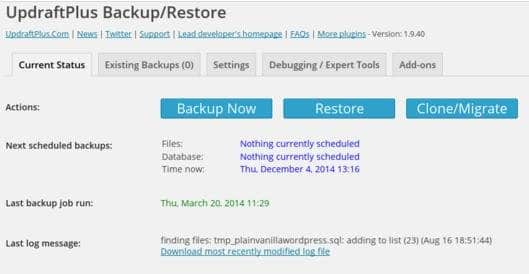

Creating a backup of the database is practiced in all the top organisations. For webmasters who work online, it's the most important thing to do.

All websites are prone to hacking. Hackers are always in search of a security loophole in a website. When they find one, they'll deface it by changing the index file. Hackers locate the site configuration file stored on the servers to find database password so that they can access the database.

If the website owner or webmaster has never created a backup, the site is gone forever. If the site is a blog, you can recover the lost post from Google search index or the Internet Archive (the Wayback machine).

Hackers can change the whois information of the website (if they get access to your domain management dashboard), but you can easily get your domain back by contacting the customer support and proving your identity.

High traffic websites like Facebook, BBC have been hacked a few times. Imagine, if Facebook engineers hadn't backed up the data, would the site have been functional?

WordPress uses the open source and free MySql database to store posts, your login, and other valuable data. Its plugin repository has a lot of plugins that let you create a full or partial backup of the website.

The plugins can be configured to run at a particular time provided your hosting provider allows you to use the cronjob or scheduler (if you're using Windows hosting).

West WordPress backup plugins,

**BWP**: This plugin can create a full website backup for you. It is simple and supports both Windows and Linux servers. BWP can function without using a large amount of RAM. It doesn't affect the performance of servers. This plugin can send backups to your email address, Dropbox, Google Drive, Rackspace, Amazon S3 and many other services.

You can select files and folders that shouldn't be included in the backup. BWP supports translation to other languages. If the DB size is large, you can create a compressed WordPress database backup (in .zip) format with this plugin. \[Download\]

**Updraft**: This is the most popular and widely used plugin to backup WordPress database. Updraft comes with a lot of functions. It supports scheduling via cronjobs. This plugin can restore your data with one click. It supports file selection, debug mode, archiving and a lot of cool features.

Updraft is compatible with all latest PHP versions. It features a data duplicator module. Backups create with this plugin can be downloaded from the WordPress dashboard. \[Download\]

If you want your WordPress Database backup to be saved on cloud storage services like Rackspace, Google Drive, Dropbox, Openstack, etc, install updraft on your hosting platform.

Although this wouldn't happen, if your hosting provider has warned you about high CPU or memory usage on a shared server, I would recommend you to use the PHPMyAdmin tool of the panel that allows you to **create WordPress database backup without plugins**.

Using PHPMyAdmin is easy. Open this tool and enter the email address and a password of your CPanel. Now you will see a list of databases in the left sidebar of PHPMyAdmin. Click on the database name and this tool will display a list of tables in the left sidebar and the columns in the 1st table in the main dashboard. Click on the Export tab of PHPMyAdmin. Now you'll find a button to create a backup. Click on this button and done! The browser will begin downloading the backup.
