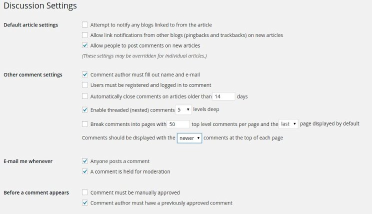

People disable comments from their website thinking that spammers or hackers will not target their sites. Well, it's true that this form is always responsible for spam, but you should never think of removing it. Spam can be easily avoided with Akismet or its alternatives.

Comments are an important section of a website. Without it, your blog would look hostile and naked. No one would like to interact with you. Many people buy products from affiliate links only after reading comments. If you remove this form from your website, your conversion will be low. Moreover, the visitor will leave your site as soon as he finishes reading your post.

If the visitor has some doubts, he won't be able to seek help unless your website has a comment or contact form.

Spammers are not the only person who look for this form. Genuine visitor or expert may want to leave feedback on your article, or they may want to recommend you a tip. If the comment has a keyword, your website will rank for that term. If there are many useful messages for your posts, your blog will rank in search engines for many t and high paying keywords.

**Additional tips**:

**Don't break comments in pages**: Unless you're using Yoast SEO plugin, never check this option in WordPress discussion settings as this may create duplicate content issues on your blog

**Pingbacks**: Discussion page in WordPress dashboard has an option to disable XMLRPC based trackbacks and pingbacks. Many bloggers will key this option checked.

**Latest discussions:** If there are a lot of comments on your blog page, the visitor will have to scroll down for a few seconds to read the most recent message left on the post. WordPress allows webmasters to display latest or newer comments at the top of the form. This option can be enabled from the Discussions settings.

**Disable Replytocom links**: Advanced section of Yoast WordPress SEO plugin allows to get rid of replytocom variables/pages that get indexed by Google and many other search engines. These pages are thin and useless. They may be responsible for a Google Panda penalty in future. Make sure that you disable this WordPress feature by checking remove replytocom option in Yoast advanced settings page.

**Conclusion**: By this point in time, you may have recognized how valuable WordPress comments are. Thus you should keep this form enabled on your site. Don't Forget to reply to comments left by visitors.
