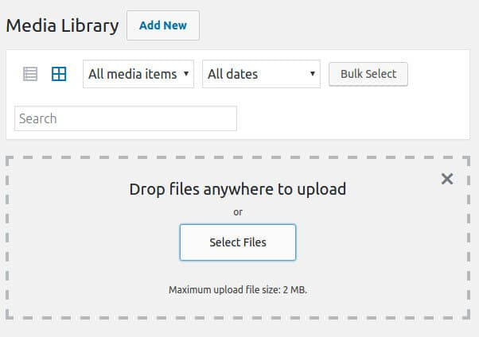

Today, I have addressed one major issue the WordPress users face i.e. HTTP error on uploading media or image files. I encountered this error yesterday while trying to upload a picture in my latest blog post. The picture uploader tool was repeatedly throwing cannot upload error.

I logged into the server and checked PHP error log files generated by the website and PHP web server. The files were clean. I checked WP memory limit in the wp-config.php file. The memory allocated to my site was 64 megabytes and all my sites were using 15% of the allocated system memory. Hence, I ruled out the low memory issue.

The image uploader didn't report of permission problem. So cross verifying file system permission was not needed. Clearing the browser cache files didn't help as well.

### How to upload images when you see HTTP error?

After exploring the WP dashboard for a few minutes, I learned that users don't have to log in to the CPanel and use its file uploader feature or any other FTP tool such as FileZilla to transfer files. The WordPress dashboard has a simple uploader tool which doesn't use AJAX or JS. The tool works like a charm. I used it to upload the image, after which I opened the post editor and used the media manager tool to insert the picture.

To access this tool, hover your mouse pointer on the Media menu in the WP dashboard. Now, select the Add New option. Try to upload the file. If the transfer fails, WordPress will show the basic browser uploader module. Click on the browse option and select image. Now, click on the upload button.

### What is the solution to the HTTP error?

While the picture upload tool wasn't working, my internet connection latency was over 300 ms. When the latency was back to normal i.e. below 80 ms, the error disappeared. If the network latency is high, you'll see the HTTP error.

The only way to fix the problem is by contacting the internet service provider.

**Conclusion**

As mentioned in our image SEO tips article, pictures are important parts of a blog post. Two reasons why people don't use them are as follows:

1. WordPress is not allowing the blogger to upload images.
2. The website owner is a newbie.

WordPress beginners should first learn the importance of image SEO. In the case 1, you must check your internet speed.
