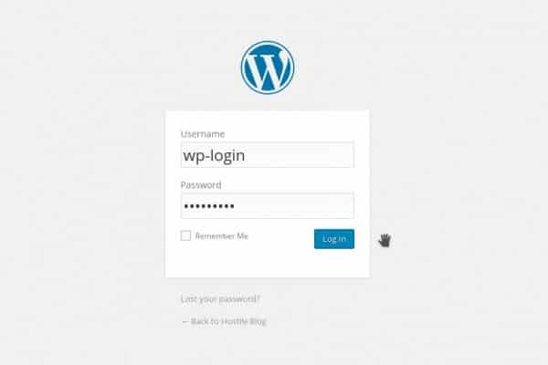

WP login.php is the most critical page on a WordPress website. Without it, you will not be able to access the WP-admin area aka the WP dashboard and other users will not be able to register an account with your website.

No website owner would ever want a hacker or an intruder to get full access to the WP-admin area. If they do manage to get its access, intruders will delete your website, change admin password or remove all your post/pages. To avoid this, you should secure the WordPress login page by:

### Tweaking server config files

To make sure that no one excluding you, trusted users and fellow writers gets access to the WP dashboard, update the htaccess or Nginx configuration file with a rule that will allow only a few IP addresses to visit (or only your IP) the wp-login.php page. If you do so, the web server will display access denied (HTTP 403) error to all users. Only trusted IPs would be able to log into the WordPress website.

IP addresses will keep changing if you're using a mobile broadband connection. In such cases, you'll have to update the configuration file with the latest IP addresses.  If your ISP has assigned a static IP to your machine, modification of files is not required.

Tutorial to block wp-admin access on Nginx.

Tutorial for Apache web servers (htaccess).

### Limiting Login Attempts

There are free WordPress security plugins that have the ability to block an IP address if its owner has repeatedly entered incorrect username and password. These plugins also send an alert message to the webmaster's email address each time an IP has been blocked.

### Changing login URL

Many people prefer using this method because it is easy to implement. The free login URL changer plugin will prevent direct access to wp-login.php. When it is active, the user will have to enter the address of the new login URL else he'll not be able to access WP dashboard until the webmaster disables the plugin.

### Few lines of PHP Code

This is yet another method to prevent unauthorized access to the wp-admin and wp-login page. The WordPress content management system has been written in PHP scripting language. If you know PHP programming, edit wp-login file and write a code to block all IP address requesting the WordPress login URL excluding your IP.

### Adding captcha

Hackers make use of automated tools to hack WordPress websites. The tool will begin a dictionary attack on your site. It will repeatedly enter random usernames and passwords to get WP admin access. If you're using a weak password, install a captcha plugin or set a stronger admin password.

**Conclusion**: The methods 1 and 3 are the best ways to the keep wp-login and wp-admin pages safe from hackers. Methods 2 and 4 are easy to implement. Use them only if you don't want to edit any files.
