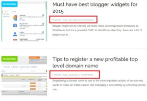
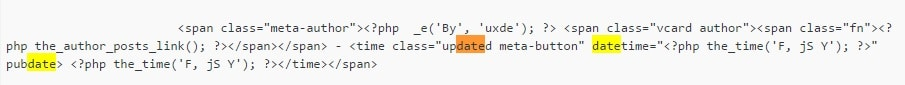

Many self-proclaimed SEO experts believe that hiding WordPress date helps in improving search engine rankings. I supported their strategy until I started thinking more about user experience and rich snippets. If you've come across a post that claims to improve SERP position after removing dates from the blog, you're being misled. Google knows when you've published a blog post through the sitemap file that has both published/modified dates. So you can't fool it.

Moreover, it has started penalizing websites with spammy rich snippets. One day it might hurt the rankings of sites that have too many rich snippet errors. You can find the details on schema.org related issues on your site in HTML improvements page of Google webmaster tools.

People use search engines to find relevant and fresh information. If you're hiding dates from dated blog posts ranking on any of the 1st three pages of Google, the conversion rate will be low, and bounce rate will be high as the visitor didn't find the information he/she was looking for. If you don't take any action on the post, Google will demote your ranking as it has discovered that user isn't interested in reading your articles.

Hiding WordPress post dates increases SERP CTR is an incorrect statement. If you think like a visitor, an article without the date is less likely to be visited if is displayed on the same search result page where there are articles with a latest date. For example, suppose there are ten search results out of which six results are displayed with their publishing date and the remaining are without a date. Which URL will you visit?

Well, an ideal approach will be displaying a date on which the post was last updated. If you're not used to coding or modifying PHP, seek help on websites like StackOverflow or wordpress.org forum.

If you know PHP, follow the below instructions:

1) Open any of your blog posts and check its source code.

2) Find the line where WordPress has added the publishing date. Most of the themes have a date in meta-info div element.

3) Download the theme folder to your hard disk; install the GREP software on your computer.

4) Open copy a word accompanied with a date. For example, one of my blog posts displays date using this code:

`<time class="updated meta-button" datetime="February 3, 2015" pubdate> February 3, 2015</time>`

I'll copy datetime word to the system clipboard.

5) Open Grep, paste the copied word and choose the theme folder saved on your PC.

6) select \*.\* search criteria and perform a search operation with grep.

7) Now you'll find a list of files containing datetime word.

8) Open the file and change the code to get published date to modified date (check its format here).

**Conclusion**:  Don't try to outsmart your readers and search engines. Follow the above tips and use modified date instead of published.
