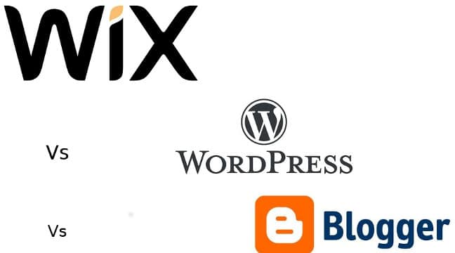

Wix has become a popular website builder ever since it switched to HTML5 from flash. WordPress is the king of all content management systems. Blogspot has been there for a long time. It is still trusted and used by 1000s of bloggers. So, which is the best content management for building a new site or blog? Go through below points to get the answer.

### Wix Review:

Winx supports various languages apart from English. It lets you log in with facebook or google account. If you log in, the site will ask you to select the category of the website you want to create. Wix lets users build the following types of websites:

- Business, design, blog.
- Online store, Restaurants and food, Beauty.
- Photography, Music, accommodation.
- Events, portfolio, other.

Select the portal type you want to launch with Wix. New users will see a walkthrough which explains in brief about the features of Wix. Click on the get started round edged button on the page. Now, you'll see the following two choices:

- Build website with Wix editor.
- Use Wix ADI to setup your website.

Select the 1st option and select the template you like. Wix offers more than 25 templates for blogging. Once you select your template, Wix will open the preview frame where you can see the template live in action. Click on the edit this site button on the top floating bar to begin customizing your Wix Blog.

Wix offers more customization options than Blogger (Blogspot). With Wix, you can change:

- The width of the menu-bar.
- The position of social network icons.
- Alignment of elements.
- Name of the site.
- The dimensions of Wix template.

Wix allows you to add thumbnails on post excerpts with 1-click. You can move the sidebar to the left or right side of the blog, and more.

Wix features a beautiful content management system that lets you manage posts. The post editor of Wix allows users to insert HTML elements. Like WordPress and Blogger, Wix supports categories and tags.

### Wix site builder cons and pros:

Cons

- Slow.
- Limited templates for a blog.

Pros:

- Good features.
- Uses HTML5 technology.

Please go through WordPress vs Blogger article to read our full review, pros, cons of Blogspot/WP platform.

### WordPress vs Wix vs Blogger (2016)

**Pricing**: WordPress is free to download content management system. Anyone can download and use WP CMS on unlimited sites. Wix has premium plans which give users access to 100s of beautiful templates. The pricing for the same starts at 122 per month aka 2 USD. Blogger is free. It doesn't have paid plans.

**Templates**: Wix has 500 to 600 templates. WordPress repository has thousands of unique themes. Blogger has 10 to 12 templates.

**Code**: WP is built with PHP scripting language. You can edit the code of a WP theme. Wix lets you insert new HTML in blog posts. It doesn't let you make changes to the code.

**Support**: WP has millions of users. WordPress forms have the answer to all questions related to the CMS. Wix support page has detailed tutorials on Wix site builder. If you need help, go through the tutorials. Additionally, Wix offers ticket based support.

**Customization:** As mentioned earlier, you can edit any line of code in a WordPress theme. For a non-technical people, WP provides a live customizer module through which users can make changes to their sites. Let's be honest, you don't have to spend time in customizing a site if you've downloaded the right theme. Wix has limited free templates. Blogspot offers up to 12 themes.

**Speed**: Wix is the slowest content management system among WP and Blogspot. WP's performance depends on the hosting platform.

\[gallery columns="1" size="full" link="none" ids="3462,3461,3460"\]

**Conclusion**: Fron the above points, one can easily conclude that WordPress is better than Wix. Wix can't be written off. In the past few years, it has emerged to be a good alternative to Blogger aka Blogspot.
