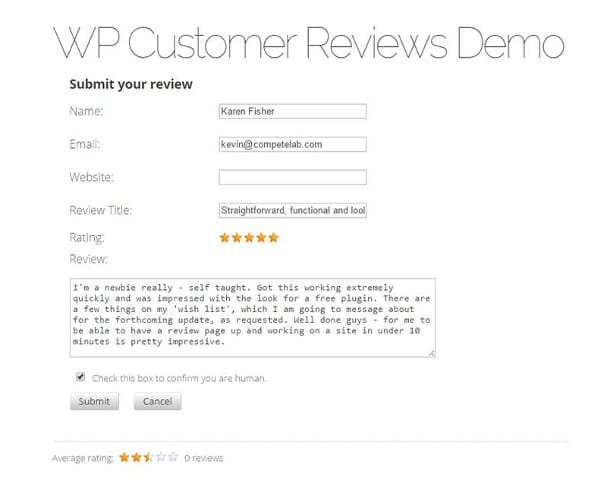

Before buying any product from a website or before contacting a business, search engine users will go through the reviews. If the reviews are negative, the user may not communicate with the business or he'll leave the website without making any purchase.

Customers are the best people to judge a product and the best way to get their feedback is by adding a review section to the website. Reviews may help in improving the rankings of a website as it may have many new keywords.

Have you checked Yelp.com? In Yelp, customers are allowed to rate and review any services of their choice. This site ranks very well in the search engines. It has over 50 million unique visitors per month.

Google allows its users to rate a business page. You'll have to create a page through your Google Plus account for the same. When a user searches for your business in Google, the ratings will be displayed along the business information, contact details and address in the upper right section of the Google search engine. If you have a WordPress website, you can easily add a review form with the WP customer reviews plugin.

The plugin is active on more than 40K websites. It is compatible with WordPress multisite architecture. When some leave a review on your site, the plugin will add the review to the moderation section so that he can approve, edit or disapprove it.

WP customer reviews plugin is SEO optimized. It generates Schema.org format reviews for the search engines. It has functions to block spam messages. This plugin supports customization, and it allows the user to place shortcodes for the review forms.

When you test the form generated by WPCR with a rich snippets tester or W3C/XHTML validator, the form will pass the test with flying colors.

WPCR is fast loading plugin that adds very less load on your website. When you install it, the plugin will add a new stylesheet to your site so that you can customize the form to match the design of your website.

Whether your site is selling a product or it is about business, you can use WP custom reviews plugin with it. WPCR supports custom fields. It works great with all types of WordPress caching plugins. You can use it on as many pages or posts as you want. Visit WordPress repository to download and install the plugin on your website.
