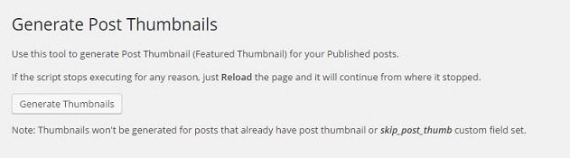
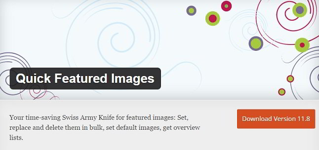
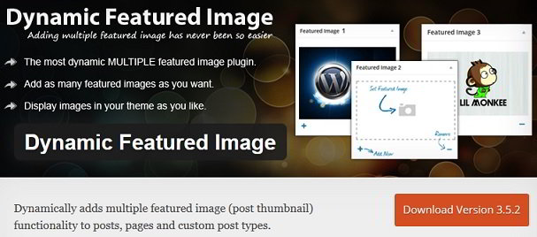

Featured image is a picture that appears in the post excerpt. When the visitor sees the image, he will find the topic interesting, relevant, and will not hesitate in exploring your website further.

All the premium and free WordPress themes launched these days support FI. If your website has 100s of posts, it is difficult to set featured images manually unless you are ready to edit posts one by one. You don't have to do so because the below free plugins will automate this task for you.

### Auto Post Thumbnail

APT is a free plugin that automates the task of inserting thumbnails in post excerpts. This plugin has a good rating of 4.2 on the WordPress.org repository. Over hundred thousand WP users are using it.

APT is a smart plugin. When your blog post has multiple pictures, it sets the first image as the excerpt's thumbnail. If you have set an FI for a post and do not want the plugin to change it, just add the below custom field in the post.

`skip_post_thumb`

\[themify\_button bgcolor='purple' link="https://wordpress.org/plugins/auto-post-thumbnail/" target="\_blank"\]Download\[/themify\_button\]

### Quick Featured images

With this plugin, the user can edit, remove, and replace hundreds of FIs in a bulk. In addition to this, QFI  shows featured images in the WordPress dashboard. The column for the same is sortable. The plugin is fast, and it works great on big WordPress websites.

\[themify\_button bgcolor="purple" link="https://wordpress.org/plugins/quick-featured-images/" target="\_blank"\]Download\[/themify\_button\]

### Dynamic Featured image

DFI is a free plugin that lets you add multiple featured images for every blog post on your website. It has an intuitive interface for the same. You don't have to write a single line of code.

DFI supports custom post types. It supports integration with third-party themes. This plugin is easy to configure.

\[themify\_button bgcolor="purple" link="https://wordpress.org/plugins/dynamic-featured-image/" target="\_blank"\]Download\[/themify\_button\]

### WP featured images: Pros and Cons

Pros:

- Makes a website user-friendly.

Cons of featured images:

**Increases disk space usage**: If you are using a hosting service that does not support unlimited storage, your site may run into a problem. Because of the FI, an extra file will be stored on the server. The plugin/theme may generate many more files in addition to this. At one point in time, there will be no room left your storing files and you'll be forced to move your WP website to another hosting provider.

**Page load time**: As an additional file will be served in a reply to the HTTP request, you will notice that your site's home page loading speed has increased.

**Increased bandwidth**: Most shared hosting plans have limitations on the number of bytes of data a website can transfer every month. If you enable featured images on your site, the images will be sent to the visitor's computer everytime he/she requests the page. If your site gets tons of repeat visitors, you can save bandwidth by installing and activating a WordPress caching plugin which will add an exipiry time to the pictures.

**Conclusion**: The plugins mentioned above will help you in adding a featured image to the post excerpt. They are free to download.
