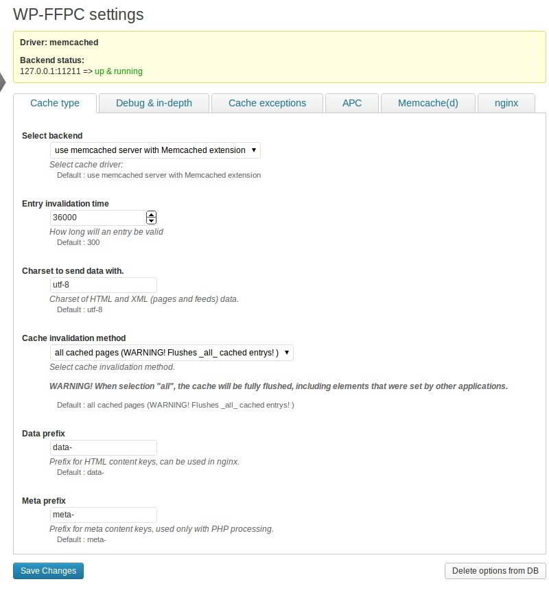

Although W3TC has options to configure Memcache and OPCache modules, this plugin requires some configuration to work according to your expectations. It includes many features that you may not want to use. To be honest, W3TC and WPSC are best plugins for Shared hosting users as users can easily make their site faster by activating disk caching, minification or by setting an expiry date for static resources.

If you've purchased a VPS package from Hostgator, Bluehost or any other hosting provider, you should try out WP-FFPC. The highlighting feature of this plugin is that it supports various types of web servers and lacks complex features. You can easily run it on NGINX, LightHTTPD, Apache 2 platforms.

**Note**: Shared hosting plans do not support Memcached, APC, Xcache, OPcache or APCU. Thus they will not allow you to use the features of WP-FFPC.

WP-FFPC makes use of powerful caching modules. It works great without making the user modify any WordPress or theme files. Below are the ideal settings for the same.

WP-FFPC is a plugin that uses system memory for caching your blog posts. It makes use of APCu and Memcached modules for storing your data.

This plugin works when you enable caching in WP-CONFIG file by adding the below line.

`define('ENABLE_CACHE', TRUE);`

If you've not enabled this feature, you will be prompted to activate it.

WP-FFPC will search for installation of Memcached, APC, APCu on your website's hosting server. You won't be able to use it if any one of these 3 modules is missing. So before you download and install the plugin, make sure that you install the required modules on your VPS.

Like the WP-SUPER CACHE plugin, WP-FFPC includes the pre-caching feature that will make your blog or WordPress website blazing fast. It supports cache scheduling, 404, canonical caching. You can set an expiry time for static website resources like JS, CSS, JPG, PNG files with it.

This free WordPress plugin is lightweight and it will not use a lot of CPU or RAM to work. A very large site (using WooCommerce, BBPress,) may require an unusual amount of RAM.

\[Download here\]

Apart from this plugin, the user should alsZende Zend or PHP OPCache that savePHPhp files of the site in a compiled form. When any of these 2 modules are active, the PHP file will be served from the cache and the PHP interpreter will not be called. This feature will speed up your site significantly.
