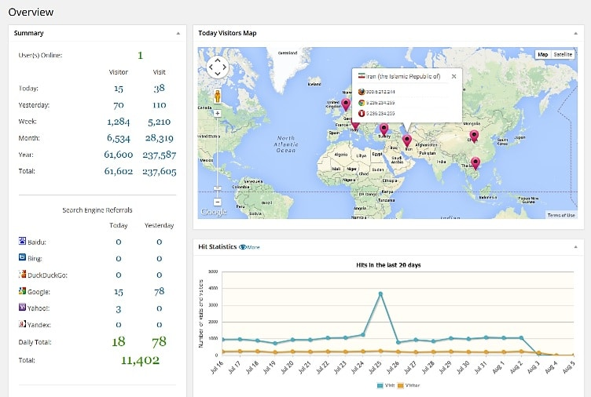
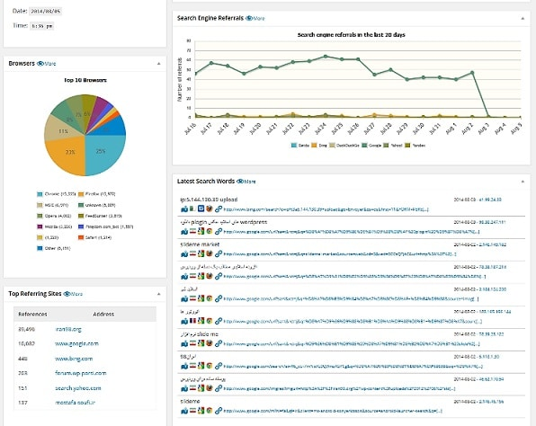

Some webmasters are concerned about their online privacy, and they will never use a popular third party analytics tool like Google Search Console, webmaster tools, clicky, StatCounter, and others.

To safeguard their website statistics, people use a plugin which will create a database to store data related to websites. One of the best plugin to do this job is WP statistics.

The plugin works 24 x 7 to update the DB with visitor data. You can use it to compare website traffic from the best search engines i.e. Google, Bing, Baidu, Yandex, DuckDuckGo.

WP Statistics makes you aware of important details of and visitor. It can track the visitor's browser version, country, recent searches, search keyword, etc.

This plugin has an option to send the tracking data to your email address. You can also export data to an XML, TSV or CSV format file. The plugin has a function to add a widget to the sidebar for making the visitors aware that your website is getting traffic.

WP Statistics supports shortcodes. It has a well-designed admin panel and manual for getting used to the plugin.

Unlike many other plugins, the developers of WP Statistics are always there for the users. If you explore the plugin's support forum, you'll find that the developers that resolved almost every issue.

WP statistics has a function to trace GeoIP location of a visitor. It displays a map so that you can easily find out from which state does your website get the maximum traffic.

The best thing about this plugin is that it doesn't affect SEO or performance of a WordPress website. You are allowed to disable data reporting for visitors based on their IP address, user roles, country, etc.

WP statistics plugin will automatically prune the data one or twice a month for saving the disk space. The plugin will automatically update the GeoIP database whenever a new update is available tTo make sure that you have correct details of the visitors.

**Conclusion**: If you're a WordPress website owner who is looking for an alternative to Google Analytics, Statcounter or Clicky, use WP statistics, and you will not be disappointed. The plugin is free to use, and it is available for download on WordPress.org.
