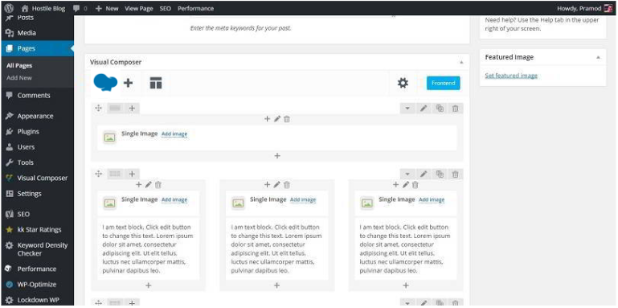
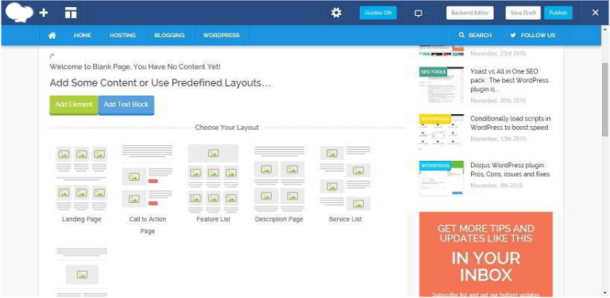

If you have sound knowledge of PHP, CSS, JS, and HTML, you can quickly build good-looking pages in WordPress. It is also possible with a WPBakery page builder plugin for WordPress. WPBakery is a well-designed plugin that lets users create various types of website layouts and pages with CTA buttons. There are around 29 great designs to choose from. WPBakery is responsive, and your site designed with it will look great on any phone or tablet. It supports all types of WordPress themes, and no other plugin will be affected by its presence. It has a frontend and backend builder.

The frontend tool will allow you to modify the existing homepage of your blog. You will be authorized to add around 40 elements to this page without writing a single line of code. The backend will let you create new pages and layouts.

WPBakery is the best plugin in its category. Unlike free alternatives, it offers a lot of elements. It is very easy to use. Thus creating a powerful SEO-optimized page is possible in just a few minutes. The user has to drag and drop the required elements on a layout. When the page has been created, the user has to publish it.

Pages created with the WPBakery plugin can be found in over half a million WordPress sites. As mentioned earlier, this plugin comes with a lot of elements to make pages more productive and influential. Some of its top modules are:

**Call to action**: CTA buttons are powerful modules that can reduce the bounce rate of your blog. It is not very easy to implement without knowing the knowledge of website technologies and scripting languages. Thankfully, WPBakery comes with a call to action module through which users can easily add CTA buttons to their WordPress pages.

**Tabbed content**: This module allows WordPress users to add tabbed HTML structure to their pages. With this feature, you can create a powerful widget that displays your recent comments, latest posts, tags in separate tabs. The visitor will find this widget interesting. Thus he'll visit a few more pages on your website before exiting.

Check WPBakery demo here

**Post Slider**: This is a powerful module that lets you create a slider with the post. PS creates responsive sliders that are SEO friendly and attractive.

**Accordions**: It adds widgets that feature collapsible modules on your page.

**FAQ**: If you're planning to add frequently asked questions section on your WordPress blog, you don't have to create a special page for it. With FAQ module in WPBakery, the user can add a toggle element.

WPBakery allows its users to add their new modules without much headache. The user has to define a function and shortcode in their website's functions.php file and the plugin will take care of the rest.

WPBakery for WordPress is often updated and optimized. Bugs found in its previous version are fixed immediately. As the update is available on a regular basis, there's no doubt that WPBakery is maintained by a dedicated support team who are ready to help users with plugin-related issues.

Because of its unusual features, the WPBakery has been featured on many top sites. It is recommended by powerful companies like Forbes, Sitepoint, Envato marketplace, etc.

WPBakery is available for download on Envato marketplace, and it has a dirt-cheap price tag of 64 dollars. Considering its powerful inbuilt elements, this plugin is worth the money.

**Conclusion**: If you're a person who wastes money in buying premium themes often, try WPBakery as it will not only save your money but will also help you in creating unlimited styles and pages.
