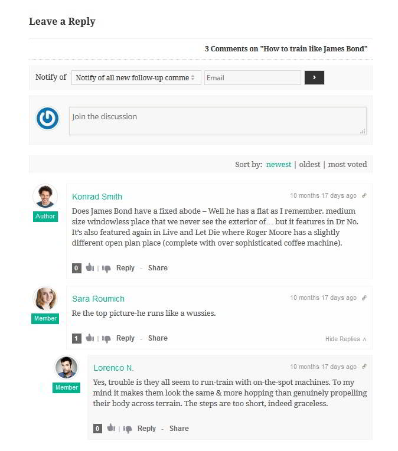
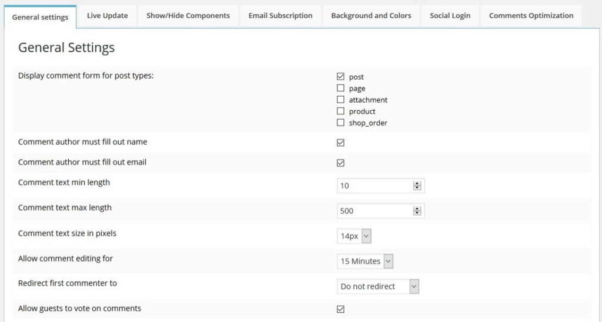
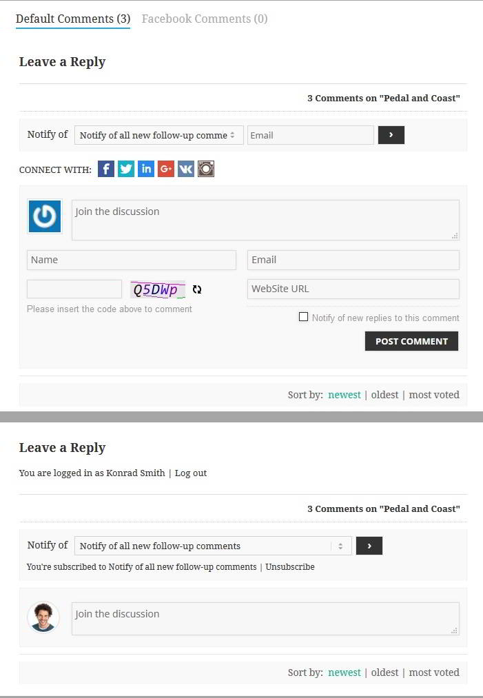

The default WordPress commenting system is good, but some people may want to replace it with a third party plugin like Disqus, Livefyre for better control, spam protection, and administration.

Disqus adds a lot of weight to your site, and you should think before using it. I've seen LiveFyre plugin on high traffic websites, and it looks great. I've not tested it. In case you're searching for a Disqus or Livefyre alternative for your WordPress site, there's a good new option available for you.

A new plugin (named WPDiscuz) for commenting has been launched, and it is available in the WordPress directory. If you want to make your comment form more interactive, then you should try out WPDiscuz.

This plugin uses Ajax technology to deliver a rich experience to the visitor. It has many built-in functions that make commenting fun. The coolest feature of WPZDiscuz is that it comes with an inbuilt spam protection system that works great. Thus it eliminates the need of installing Akismet or annoying captcha systems on your blog.

WPDiscuz lets your visitors share the comment URL. They're also allowed to upvote or downvote it. When the guest replies to your post, the page will lot reload. The comment form will use ajax to add a comment. This process is fast, and you'll love it.

This plugin supports different time formats, and it gives you an option to load comments asynchronously or via a click of the button. When a post on your blog has a lot of images, the plugin will improve page load time as only a few comments will be displayed.

WPDiscuz is compatible with various caching plugins, and you can integrate it with any WordPress blog. It includes Subscribe to comments and social login module too.

WPDiscuz has a settings page in which you can configure the locations the plugin should appear. You can add captcha forms or enable user registration through this page. The comment form's background, foreground, text and title colors can be easily changed via WPDiscuz settings. If you know CSS coding, you can add your custom code for this plugin.

When I had tested WPDiscuz on my site, the number of comments had increased substantially, but I had to remove it because of the Jquery-UI script that increased the page size. For better performance, you should replace Jquery UI with the script from Google CDN.
