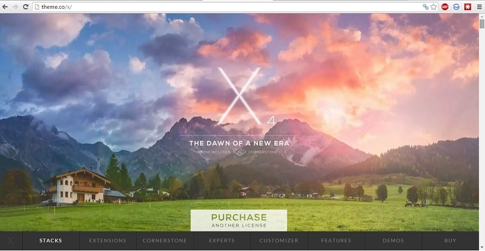
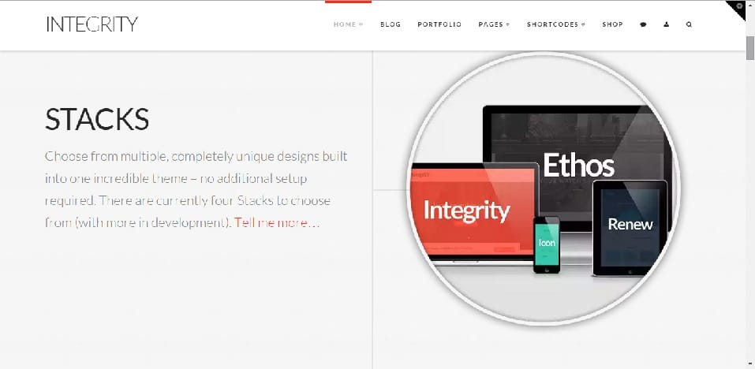
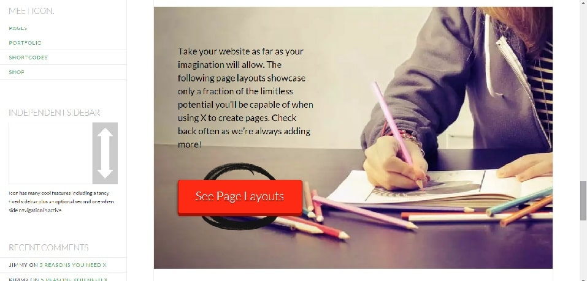
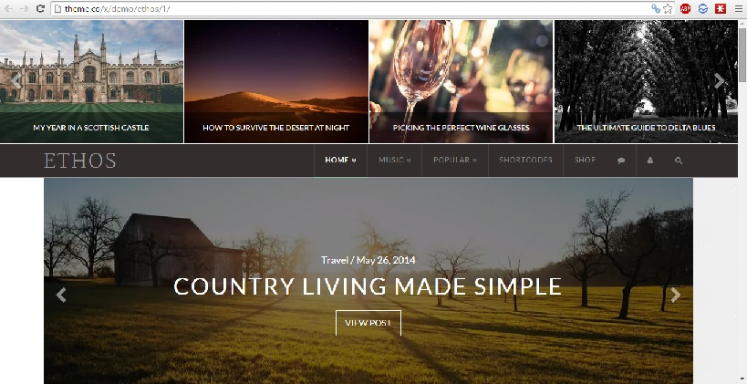
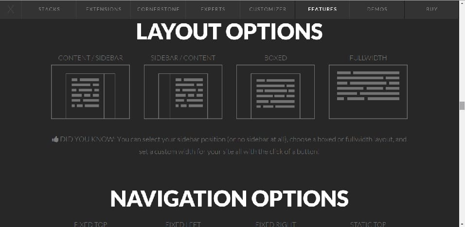

Bloggers want a lot of features in their themes. They also expect their WordPress blogs and websites to load fast. Free templates have limited support and features. Thus, many of the bloggers buy a premium template. Before they make payment, the user will explore 100s of available options. This task induces a headache and creates a lot of confusion.

Thus, it is a job for professional and experienced bloggers like me to make newbies or WordPress users aware of the top themes. Last week, we published a detailed review of Newspaper template. Today, we've discussed one of the most popular and powerful WordPress theme named X. No other WP template is as perfect and user-friendly as X.

Themeco is the developer of X. The design and development team has put a lot of hard work to make their latest template compatible with every mobile device in the world. They're experts in responsive designs.

X theme has many features. Thus, website owners will not have to research and experiment with plugins. They can concentrate on the content. The theme is live on 1000s of sites. It is one of the top selling product on the Envato market. Even though there are 50K users; X theme has an excellent rating of 4.71/5 which indicates that customers who have bought this template are highly satisfied with the performance as well as the features. Here are the necessary modules that you'll find in the X theme:

**Download X theme here**

### Cornerstone

The best WordPress premium themes include a page builder utility, and Themico's X is no different. X comes with cornerstone which is known to be one of the finest and intuitive front end tool. Use cornerstone and design your theme's homepage without typing a single line of code. This tool is updated on regular basis.

### Design aka Stacks

Version 4.0 of X theme includes powerful and easy to customize designs that are suitable for any blog/website, i.e., business, food, technology, video, etc. Each design is modern, flat and responsive. It will attract user's attention which in turn will make them explore your content further. Design in X theme is known as stacks. There are four stacks that you can use, i.e., Integrity, Icon, ethos and renew. Here are the features of the four designs:

**Ethos**: This stack allows you to create visually stunning magazine (newspaper) sites. It comes with real-time filter tool, carousel, and attractive index titles.

**ICON**: This template reminds of blogging networks. It is based on minimal responsive design. ICON has many layout options. It gives users app like feeling. It allows the user to change post format colors.

**Renew**: This X Theme stack is based on flat and modern design. It has an option to customize background color.

**Integrity**: It has a clean portfolio design that dark/light color choices. Integrity stack has an option to adjust transparency. You can tweak this design and use it for any purpose you want.

You can use the above stacks to launch tech, sports, and other news blogs. You can also use them to start eCommerce store, blogging, tutorials or business website. They support bbpress, shortcodes, WooCommerce and all other popular plugins that you know.

**Download or Check demo of X theme here.**

### Premium plugins

Do you know that you'll be a proud owner of a bunch of premium plugins when you buy the X theme? Yes, that's right. Here are the plugins that will be offered to you at no additional costs:

**Soliloquy**: It allows you to create beautiful responsive sliders that are SEO (Google and Bing) friendly.

**Mailchimp**: If you love email marketing, X theme includes an easy to configure MailChimp plugin. The beautiful forms will make users enter their email address and subscribe to your updates.

**Facebook comments**: Social traffic is crucial. X theme makes sure that are in touch with social networks as it comes with a Facebook comment plugin. We all know that it's hard to add Facebook features to our websites/blogs. This theme has made our job easier.

**Videolock**: This is an inbuilt video marketing utility that features a CTA. Videolock can improve visitor engagement thereby reducing the bounce rate.

**Content dock**: This is yet another marketing plugin that X theme offers to its users. If you use content dock feature smartly, your conversion rate and sales will increase.

**White label**: If you have activated visitor registration, the White plugin will let you customize the wp-login page. You can add some details about your brand, company to the page.

Others plugins included with X theme package are slider revolution, under construction, terms of use, visual composes, olark integration, custom 404, etc

**Download/Buy this theme here.**

### Expert team:

During the development of the X theme, the designers and developers will constantly in touch with some popular WordPress experts and Internet marketing professionals. This theme is tweaked on the suggestions and feedback provided by the experts.

### Customizer:

The love preview tool in WordPress is not very powerful. Sometimes it fails to function properly. Customizer is themeco's tool that lets users preview their customization before the theme is live on a site. This is one of the most important features of X.

### Google Fonts:

X theme supports more than 500 Google fonts. As the files are hosted on CDN, they won't affect the page load time of your blog/website.

### Seo friendly

A premium template is not useful if it doesn't follow Google webmaster guidelines and HTML 5 standards. X theme has immaculate code that adheres to every latest design and SEO standards. Thus, it will help you to rank your blog posts high in Google and other search engines like Yahoo, Bing.

### Backgrounds

To make your blog or website look attractive, you can add an image or set a custom solid color to the background. You can set picture background for individual posts and pages.

Other features are unlimited sidebars, 35+ shortcodes, mega menu, table support, retina ready, automatic thumbnail sizing, etc.

**Conclusion**: As you can see in the above images and paragraphs, the theme looks attractive, and it has a lot of modules to improve visitors experience and your income. X theme is awesome, but it is not free. This template is priced at $69, and it is worth the money. It is available for download on **Envato marketplace i.e., ThemeForest.**
