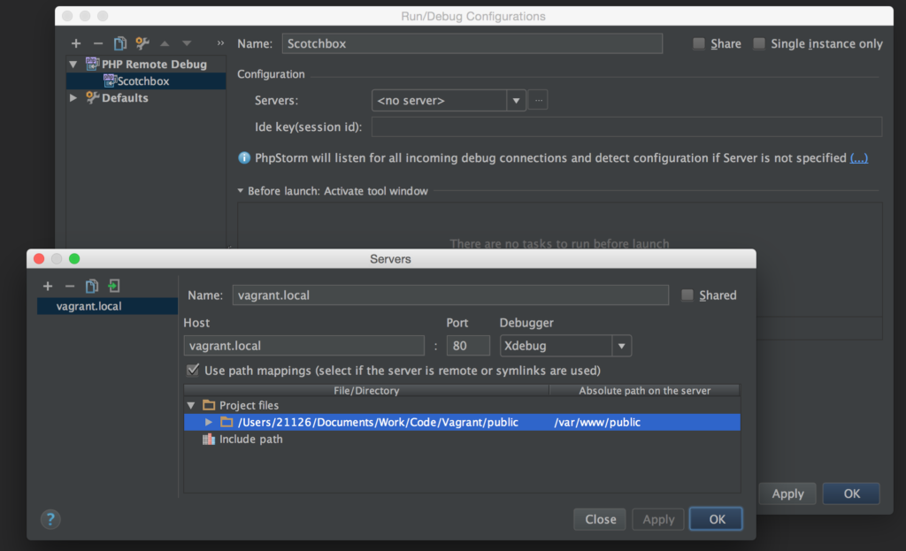
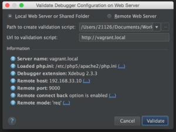

I come from a .NET background where I was spoiled by the ease of use and integration of Visual Studio. Recently much of my development work has moved to the open source and the world of Drupal 8 where I have gotten by until recently with Sublime Text and Atom. Since I have started writing custom modules, I needed a way to effectively debug my code and I had heard good things about the PHP debugger Xdebug. Unfortunately it can be a little tricky to setup, so I have outlined the basic steps I needed to go through using my favorite Vagrant environment Scotchbox. If you are unfamiliar with Scotchbox, check out my earlier posts Scotchbox Vagrant LAMP Stack and Drupal Development Environment in less than 10 Minutes

## Step 1 - Installing Xdebug for Scotchbox Vagrant

Scotchbox is a clean Vagrant environment for LAMP development without all the frills of more comprehensive setups, therefore it does not come with Xdebug out of the box. Thankfully though, installing Xdebug is straight forward, especially with the help of Rocinante's Tech Stuff, who outlines the steps necessary to get Xdebug up and running quickly:

SSH in to your Scotchbox Vagrant instance and run the following to get the latest package lists:

```
sudo apt-get update
```

Next run the following commands to install Xdebug:

```
sudo apt-get install php5-xdebug sudo service apache2 restart
```

Edit php.ini:

```
sudo nano /etc/php5/apache2/php.ini
```

Add the following lines:

```
[xdebug] zend_extension="/usr/lib/php5/20131226/xdebug.so" xdebug.remote_enable=on xdebug.remote_connect_back=on xdebug.remote_host=192.168.33.10
```

## Step 2 - Configuring PHPStorm

There are several different ways to setup PHPStorm and Xdebug with Vagrant. For simplicity we are going to use remote debug with a Chrome plugin called Xdebug Helper. First let's setup PHPStorm.

- Open your PHPStorm project and then go to Run -> Edit Configurations
- Click + and select "PHP Remote Debug"
- Enter a name for the configuration and then select ... next to servers in order to add a new server configuration
- In the Servers window click + and provide name and host of your server (e.g. vagrant.local)
- Select "Use Path Settings" and provide the absolute path to your project (usually /var/www/projectname)
- Click Apply and then click OK to save server settings
- Enter "PHPSTORM" for Ide key (session id) and then click OK



  
If you have set everything up correctly you can verify your server and debugging configuration is correct by selecting run -> Web Server Debug Validation. Enter the vagrant URL where your project is located (e.g. vagrant.local) and click Validate. If you are successful you should see output similar to the screenshot below.



  
If you receive a connection error, verify your VM is up and running and recheck your settings. If you are using a different type of Vagrant setup from Scotchbox, check out this excellent tutorial over at SitePoint.

## Step 3 - Install and Configure Xdebug Helper

Download Xdebug Helper from the Chrome store. Go to Xdebug Helper options and select PhpStorm for IDE Key. At this point everything should be up and running. Next you can test by inserting a breakpoint in your code.

- Add a breakpoint to a section of your PHP code. I used the default scotchbox index.php and placed a breakpoint before the mysql checks.
- Select Run -> Debug 'Scotchbox' or click the small green bug icon on the top right hand corner of the IDE
- Browse to you project page (e.g. vagrant.local) and select 'Debug' from the Xdebug Helper icon
- Refresh your page and your breakpoint should be hit in the IDE.

You can use the various debug options in PHPStorm to step in and out of code sections. For more information on debugging within PHPStorm visit JetBrain's Debugging PHP Applications documentation. That's it, now you're up and running debugging your applications with Scotchbox and PHPStorm.
