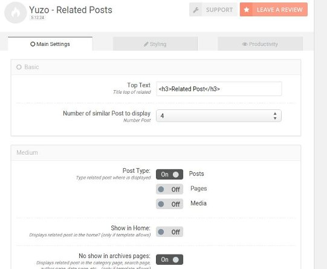
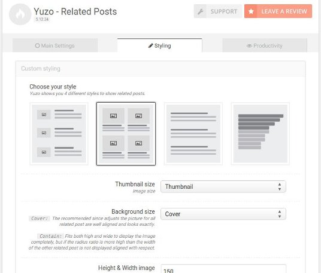
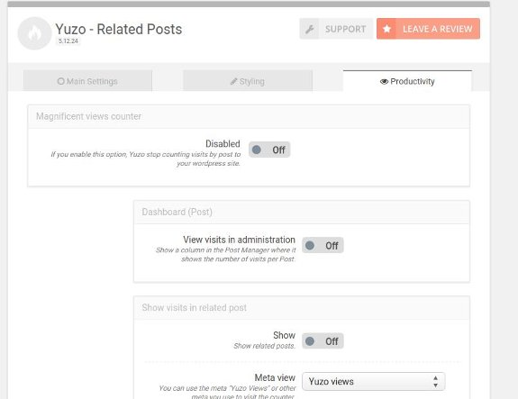

The developer claims that Yuzo is the fastest and the best plugin for WordPress. We decided to give it a try. Below is our review of this free plugin:

Yuzo can be installed via FTP or WordPress dashboard. After its installation, activate the plugin and navigate to its settings page. This page has three tabs, main settings, styling, and productivity.

You can configure this plugin to display maximum 50 related posts per page. You can set a custom title for the relevant content.

This plugin has an option to enable or disable related links on pages, post or media files. If thumbnails are not generated on your website, you can set a default thumbnail in it.

Yuzo can display posts related to tags, categories or both the taxonomies. The posts can be ordered by the title, ID, author, date modified, comment count or randomly. The plugin has an option to open hyperlinks in new tabs. If you don't want your website to leak page rank to related content, the plugin allows you to add nofollow HTML attribute to the hyperlinks. It has an option to exclude posts by tags, categories or their ID. You can turn off related links for a particular category.

Styling is the most important feature of Yuzo. This plugin allows users to choose one of the four predefined styles. Two styles support thumbnail and renaming ones display related posts without images.

Yuzo WordPress plugin lets you set a thumbnail size and background image for the RP. You can configure the image type as a square or rectangle. You can add background and hover color in Yuzo to make the related posts interface look more compelling. You can also set a border, padding and margin (top, right, bottom, left) to the thumbnails.

Yuzo plugin for WordPress can display related posts with/without excerpts. You can change the text color, font size, link color, length of the RP. Yuzo has an option to add custom CSS codes.

To track how many people clicked on the related posts, Yuzo comes with an inbuilt counter that uses WordPress admin-ajax to register the counts. The plugin can display the number of user clicks in the WP dashboard.

For faster and powerful performance, Yuzo comes with its caching system. It supports RTL. The related posts in this plugin can be added via shortcodes.

Download link

**Final Verdict**: Yuzo is fast, but it has a bug. Despite disabling its counter, the plugin adds admin ajax links to the website's pages or posts. Too many ajax requests can slow down a site. It may have issues on shared hosting platform. Moreover, when you open the admin-ajax link, the browser will display 0. Google may consider this as a soft 404 error.
